---
<span style="font-size:3em;">**Supplementary Analysis & Results**</span>

---

<h1>Table of Contents<span class="tocSkip"></span></h1>
<div class="toc"><ul class="toc-item"><li><span><a href="#Set-up" data-toc-modified-id="Set-up-1"><span class="toc-item-num">1&nbsp;&nbsp;</span>Set up</a></span><ul class="toc-item"><li><span><a href="#R-version-used" data-toc-modified-id="R-version-used-1.1"><span class="toc-item-num">1.1&nbsp;&nbsp;</span>R version used</a></span></li><li><span><a href="#Libraries" data-toc-modified-id="Libraries-1.2"><span class="toc-item-num">1.2&nbsp;&nbsp;</span>Libraries</a></span></li><li><span><a href="#Functions" data-toc-modified-id="Functions-1.3"><span class="toc-item-num">1.3&nbsp;&nbsp;</span>Functions</a></span><ul class="toc-item"><li><span><a href="#Stop-signal-analysis-function" data-toc-modified-id="Stop-signal-analysis-function-1.3.1"><span class="toc-item-num">1.3.1&nbsp;&nbsp;</span>Stop-signal analysis function</a></span></li><li><span><a href="#Plot-Means" data-toc-modified-id="Plot-Means-1.3.2"><span class="toc-item-num">1.3.2&nbsp;&nbsp;</span>Plot Means</a></span></li><li><span><a href="#Get-Outliers" data-toc-modified-id="Get-Outliers-1.3.3"><span class="toc-item-num">1.3.3&nbsp;&nbsp;</span>Get Outliers</a></span></li><li><span><a href="#Do-Correlations" data-toc-modified-id="Do-Correlations-1.3.4"><span class="toc-item-num">1.3.4&nbsp;&nbsp;</span>Do Correlations</a></span></li><li><span><a href="#Plot-Correlations" data-toc-modified-id="Plot-Correlations-1.3.5"><span class="toc-item-num">1.3.5&nbsp;&nbsp;</span>Plot Correlations</a></span></li><li><span><a href="#2x2-Repeated-Measures-ANOVA" data-toc-modified-id="2x2-Repeated-Measures-ANOVA-1.3.6"><span class="toc-item-num">1.3.6&nbsp;&nbsp;</span>2x2 Repeated Measures ANOVA</a></span></li><li><span><a href="#Other-functions" data-toc-modified-id="Other-functions-1.3.7"><span class="toc-item-num">1.3.7&nbsp;&nbsp;</span>Other functions</a></span></li></ul></li></ul></li><li><span><a href="#Behavioural-performance" data-toc-modified-id="Behavioural-performance-2"><span class="toc-item-num">2&nbsp;&nbsp;</span>Behavioural performance</a></span><ul class="toc-item"><li><span><a href="#Load-the-data" data-toc-modified-id="Load-the-data-2.1"><span class="toc-item-num">2.1&nbsp;&nbsp;</span>Load the data</a></span></li><li><span><a href="#Stop-signal-task-performance" data-toc-modified-id="Stop-signal-task-performance-2.2"><span class="toc-item-num">2.2&nbsp;&nbsp;</span>Stop-signal task performance</a></span><ul class="toc-item"><li><span><a href="#Summary-data-and-decriptives" data-toc-modified-id="Summary-data-and-decriptives-2.2.1"><span class="toc-item-num">2.2.1&nbsp;&nbsp;</span>Summary data and decriptives</a></span><ul class="toc-item"><li><span><a href="#Per-subject" data-toc-modified-id="Per-subject-2.2.1.1"><span class="toc-item-num">2.2.1.1&nbsp;&nbsp;</span>Per subject</a></span></li><li><span><a href="#Group-aggregated" data-toc-modified-id="Group-aggregated-2.2.1.2"><span class="toc-item-num">2.2.1.2&nbsp;&nbsp;</span>Group aggregated</a></span></li></ul></li><li><span><a href="#Result-plots" data-toc-modified-id="Result-plots-2.2.2"><span class="toc-item-num">2.2.2&nbsp;&nbsp;</span>Result plots</a></span></li></ul></li><li><span><a href="#Think/No-Think-task-performance" data-toc-modified-id="Think/No-Think-task-performance-2.3"><span class="toc-item-num">2.3&nbsp;&nbsp;</span>Think/No-Think task performance</a></span><ul class="toc-item"><li><span><a href="#Summary-data-and-decriptives" data-toc-modified-id="Summary-data-and-decriptives-2.3.1"><span class="toc-item-num">2.3.1&nbsp;&nbsp;</span>Summary data and decriptives</a></span><ul class="toc-item"><li><span><a href="#Per-subject" data-toc-modified-id="Per-subject-2.3.1.1"><span class="toc-item-num">2.3.1.1&nbsp;&nbsp;</span>Per subject</a></span></li><li><span><a href="#Group-aggregated" data-toc-modified-id="Group-aggregated-2.3.1.2"><span class="toc-item-num">2.3.1.2&nbsp;&nbsp;</span>Group aggregated</a></span></li></ul></li><li><span><a href="#Result-plots" data-toc-modified-id="Result-plots-2.3.2"><span class="toc-item-num">2.3.2&nbsp;&nbsp;</span>Result plots</a></span></li><li><span><a href="#SIF-effect-(conditionalised,-SP-and-IP)" data-toc-modified-id="SIF-effect-(conditionalised,-SP-and-IP)-2.3.3"><span class="toc-item-num">2.3.3&nbsp;&nbsp;</span>SIF effect (conditionalised, SP and IP)</a></span></li></ul></li><li><span><a href="#SSRT-and-SIF-outliers" data-toc-modified-id="SSRT-and-SIF-outliers-2.4"><span class="toc-item-num">2.4&nbsp;&nbsp;</span>SSRT and SIF outliers</a></span><ul class="toc-item"><li><span><a href="#Outliers-with-Unconditionalised-SIF" data-toc-modified-id="Outliers-with-Unconditionalised-SIF-2.4.1"><span class="toc-item-num">2.4.1&nbsp;&nbsp;</span>Outliers with Unconditionalised SIF</a></span></li><li><span><a href="#Outliers-with-Conditionalised-SIF" data-toc-modified-id="Outliers-with-Conditionalised-SIF-2.4.2"><span class="toc-item-num">2.4.2&nbsp;&nbsp;</span>Outliers with Conditionalised SIF</a></span></li></ul></li><li><span><a href="#SSRT-and-SIF-correlation" data-toc-modified-id="SSRT-and-SIF-correlation-2.5"><span class="toc-item-num">2.5&nbsp;&nbsp;</span>SSRT and SIF correlation</a></span><ul class="toc-item"><li><span><a href="#Figure-4a" data-toc-modified-id="Figure-4a-2.5.1"><span class="toc-item-num">2.5.1&nbsp;&nbsp;</span>Figure 4a</a></span></li></ul></li><li><span><a href="#SSRTs-accounting-for-Stop-Trigger-Failures" data-toc-modified-id="SSRTs-accounting-for-Stop-Trigger-Failures-2.6"><span class="toc-item-num">2.6&nbsp;&nbsp;</span>SSRTs accounting for Stop Trigger Failures</a></span><ul class="toc-item"><li><span><a href="#Outliers" data-toc-modified-id="Outliers-2.6.1"><span class="toc-item-num">2.6.1&nbsp;&nbsp;</span>Outliers</a></span><ul class="toc-item"><li><span><a href="#Outliers-with-Unconditionalised-SIF" data-toc-modified-id="Outliers-with-Unconditionalised-SIF-2.6.1.1"><span class="toc-item-num">2.6.1.1&nbsp;&nbsp;</span>Outliers with Unconditionalised SIF</a></span></li><li><span><a href="#Outliers-with-Conditionalised-SIF" data-toc-modified-id="Outliers-with-Conditionalised-SIF-2.6.1.2"><span class="toc-item-num">2.6.1.2&nbsp;&nbsp;</span>Outliers with Conditionalised SIF</a></span></li></ul></li><li><span><a href="#tfSSRT-and-SIF-correlation" data-toc-modified-id="tfSSRT-and-SIF-correlation-2.6.2"><span class="toc-item-num">2.6.2&nbsp;&nbsp;</span>tfSSRT and SIF correlation</a></span></li></ul></li><li><span><a href="#Trigger-Failure-and-SSRT-correlation" data-toc-modified-id="Trigger-Failure-and-SSRT-correlation-2.7"><span class="toc-item-num">2.7&nbsp;&nbsp;</span>Trigger Failure and SSRT correlation</a></span></li><li><span><a href="#Trigger-Failure-and-SIF-correlation" data-toc-modified-id="Trigger-Failure-and-SIF-correlation-2.8"><span class="toc-item-num">2.8&nbsp;&nbsp;</span>Trigger Failure and SIF correlation</a></span><ul class="toc-item"><li><span><a href="#Outliers" data-toc-modified-id="Outliers-2.8.1"><span class="toc-item-num">2.8.1&nbsp;&nbsp;</span>Outliers</a></span><ul class="toc-item"><li><span><a href="#Ouliers-with-Unconditionalised-SIF" data-toc-modified-id="Ouliers-with-Unconditionalised-SIF-2.8.1.1"><span class="toc-item-num">2.8.1.1&nbsp;&nbsp;</span>Ouliers with Unconditionalised SIF</a></span></li><li><span><a href="#Outliers-with-Conditionalised-SIF" data-toc-modified-id="Outliers-with-Conditionalised-SIF-2.8.1.2"><span class="toc-item-num">2.8.1.2&nbsp;&nbsp;</span>Outliers with Conditionalised SIF</a></span></li></ul></li><li><span><a href="#Correlation" data-toc-modified-id="Correlation-2.8.2"><span class="toc-item-num">2.8.2&nbsp;&nbsp;</span>Correlation</a></span></li></ul></li></ul></li><li><span><a href="#Brain-behaviour-correlation" data-toc-modified-id="Brain-behaviour-correlation-3"><span class="toc-item-num">3&nbsp;&nbsp;</span>Brain-behaviour correlation</a></span></li><li><span><a href="#ROI-analysis:-inhibitory-targets,-hippocampus-and-M1" data-toc-modified-id="ROI-analysis:-inhibitory-targets,-hippocampus-and-M1-4"><span class="toc-item-num">4&nbsp;&nbsp;</span>ROI analysis: inhibitory targets, hippocampus and M1</a></span><ul class="toc-item"><li><span><a href="#Load-the-data" data-toc-modified-id="Load-the-data-4.1"><span class="toc-item-num">4.1&nbsp;&nbsp;</span>Load the data</a></span></li><li><span><a href="#ROI-x-Modality-interaction" data-toc-modified-id="ROI-x-Modality-interaction-4.2"><span class="toc-item-num">4.2&nbsp;&nbsp;</span>ROI x Modality interaction</a></span><ul class="toc-item"><li><span><a href="#Prepare-the-data" data-toc-modified-id="Prepare-the-data-4.2.1"><span class="toc-item-num">4.2.1&nbsp;&nbsp;</span>Prepare the data</a></span></li><li><span><a href="#Run-2x2-ANOVA" data-toc-modified-id="Run-2x2-ANOVA-4.2.2"><span class="toc-item-num">4.2.2&nbsp;&nbsp;</span>Run 2x2 ANOVA</a></span></li><li><span><a href="#Target-region-x-Modality-interaction-plot" data-toc-modified-id="Target-region-x-Modality-interaction-plot-4.2.3"><span class="toc-item-num">4.2.3&nbsp;&nbsp;</span>Target region x Modality interaction plot</a></span><ul class="toc-item"><li><span><a href="#Figure-5a" data-toc-modified-id="Figure-5a-4.2.3.1"><span class="toc-item-num">4.2.3.1&nbsp;&nbsp;</span>Figure 5a</a></span></li></ul></li><li><span><a href="#Interaction-results" data-toc-modified-id="Interaction-results-4.2.4"><span class="toc-item-num">4.2.4&nbsp;&nbsp;</span>Interaction results</a></span></li><li><span><a href="#Main-effects" data-toc-modified-id="Main-effects-4.2.5"><span class="toc-item-num">4.2.5&nbsp;&nbsp;</span>Main effects</a></span></li><li><span><a href="#Downregulation-of-Hippocampus-vs-M1-for-Memory-modality" data-toc-modified-id="Downregulation-of-Hippocampus-vs-M1-for-Memory-modality-4.2.6"><span class="toc-item-num">4.2.6&nbsp;&nbsp;</span>Downregulation of Hippocampus vs M1 for Memory modality</a></span></li><li><span><a href="#Downregulation-of-Hippocampus-vs-M1-for-Action-modality" data-toc-modified-id="Downregulation-of-Hippocampus-vs-M1-for-Action-modality-4.2.7"><span class="toc-item-num">4.2.7&nbsp;&nbsp;</span>Downregulation of Hippocampus vs M1 for Action modality</a></span></li></ul></li><li><span><a href="#Below-baseline-activity-in-Hippocampus-and-M1" data-toc-modified-id="Below-baseline-activity-in-Hippocampus-and-M1-4.3"><span class="toc-item-num">4.3&nbsp;&nbsp;</span>Below baseline activity in Hippocampus and M1</a></span><ul class="toc-item"><li><span><a href="#Prepare-the-data" data-toc-modified-id="Prepare-the-data-4.3.1"><span class="toc-item-num">4.3.1&nbsp;&nbsp;</span>Prepare the data</a></span></li><li><span><a href="#Plotting-function" data-toc-modified-id="Plotting-function-4.3.2"><span class="toc-item-num">4.3.2&nbsp;&nbsp;</span>Plotting function</a></span></li><li><span><a href="#Add-annotations-to-the-plots" data-toc-modified-id="Add-annotations-to-the-plots-4.3.3"><span class="toc-item-num">4.3.3&nbsp;&nbsp;</span>Add annotations to the plots</a></span></li><li><span><a href="#Figure-5b" data-toc-modified-id="Figure-5b-4.3.4"><span class="toc-item-num">4.3.4&nbsp;&nbsp;</span>Figure 5b</a></span></li><li><span><a href="#M1-below-baseline-during-Stop" data-toc-modified-id="M1-below-baseline-during-Stop-4.3.5"><span class="toc-item-num">4.3.5&nbsp;&nbsp;</span>M1 below baseline during Stop</a></span></li><li><span><a href="#Hippocampus-below-baseline-during-No-Think" data-toc-modified-id="Hippocampus-below-baseline-during-No-Think-4.3.6"><span class="toc-item-num">4.3.6&nbsp;&nbsp;</span>Hippocampus below baseline during No-Think</a></span></li></ul></li></ul></li><li><span><a href="#Pattern-classification-results" data-toc-modified-id="Pattern-classification-results-5"><span class="toc-item-num">5&nbsp;&nbsp;</span>Pattern classification results</a></span><ul class="toc-item"><li><span><a href="#Data-and-functions" data-toc-modified-id="Data-and-functions-5.1"><span class="toc-item-num">5.1&nbsp;&nbsp;</span>Data and functions</a></span></li><li><span><a href="#Domain-general-and-domain-specific-representations-of-inhibition" data-toc-modified-id="Domain-general-and-domain-specific-representations-of-inhibition-5.2"><span class="toc-item-num">5.2&nbsp;&nbsp;</span>Domain-general and domain-specific representations of inhibition</a></span><ul class="toc-item"><li><span><a href="#Prepare-data" data-toc-modified-id="Prepare-data-5.2.1"><span class="toc-item-num">5.2.1&nbsp;&nbsp;</span>Prepare data</a></span></li><li><span><a href="#Classification-accuracies-(one-sample-t-tests,-Bonf.-corrected-for-nr-of-ROIs)" data-toc-modified-id="Classification-accuracies-(one-sample-t-tests,-Bonf.-corrected-for-nr-of-ROIs)-5.2.2"><span class="toc-item-num">5.2.2&nbsp;&nbsp;</span>Classification accuracies (one-sample t-tests, Bonf. corrected for nr of ROIs)</a></span></li><li><span><a href="#Pair-wise-comparisons-of-domains-(Bonf.-corrected-for-nr-of-ROIs)" data-toc-modified-id="Pair-wise-comparisons-of-domains-(Bonf.-corrected-for-nr-of-ROIs)-5.2.3"><span class="toc-item-num">5.2.3&nbsp;&nbsp;</span>Pair-wise comparisons of domains (Bonf. corrected for nr of ROIs)</a></span></li><li><span><a href="#Figure-5c" data-toc-modified-id="Figure-5c-5.2.4"><span class="toc-item-num">5.2.4&nbsp;&nbsp;</span>Figure 5c</a></span></li><li><span><a href="#Domain-specific->-Domain-general-across-ROIs" data-toc-modified-id="Domain-specific->-Domain-general-across-ROIs-5.2.5"><span class="toc-item-num">5.2.5&nbsp;&nbsp;</span>Domain-specific &gt; Domain-general across ROIs</a></span></li></ul></li><li><span><a href="#Domain-general-and-Within-domain-representations" data-toc-modified-id="Domain-general-and-Within-domain-representations-5.3"><span class="toc-item-num">5.3&nbsp;&nbsp;</span>Domain-general and Within-domain representations</a></span><ul class="toc-item"><li><span><a href="#Prepare-data" data-toc-modified-id="Prepare-data-5.3.1"><span class="toc-item-num">5.3.1&nbsp;&nbsp;</span>Prepare data</a></span></li><li><span><a href="#Classification-accuracies-(one-sample-t-tests,-Bonf.-corrected-for-nr-of-ROIs)" data-toc-modified-id="Classification-accuracies-(one-sample-t-tests,-Bonf.-corrected-for-nr-of-ROIs)-5.3.2"><span class="toc-item-num">5.3.2&nbsp;&nbsp;</span>Classification accuracies (one-sample t-tests, Bonf. corrected for nr of ROIs)</a></span></li><li><span><a href="#Pair-wise-comparisons-of-domains-(Bonf.-corrected-for-nr-of-ROIs)" data-toc-modified-id="Pair-wise-comparisons-of-domains-(Bonf.-corrected-for-nr-of-ROIs)-5.3.3"><span class="toc-item-num">5.3.3&nbsp;&nbsp;</span>Pair-wise comparisons of domains (Bonf. corrected for nr of ROIs)</a></span></li><li><span><a href="#Main-plot" data-toc-modified-id="Main-plot-5.3.4"><span class="toc-item-num">5.3.4&nbsp;&nbsp;</span>Main plot</a></span></li><li><span><a href="#Within-domain->-Domain-general-across-ROIs" data-toc-modified-id="Within-domain->-Domain-general-across-ROIs-5.3.5"><span class="toc-item-num">5.3.5&nbsp;&nbsp;</span>Within-domain &gt; Domain-general across ROIs</a></span></li></ul></li><li><span><a href="#Cross-Action-to-Thought-and-Action-domain-representations" data-toc-modified-id="Cross-Action-to-Thought-and-Action-domain-representations-5.4"><span class="toc-item-num">5.4&nbsp;&nbsp;</span>Cross Action-to-Thought and Action-domain representations</a></span><ul class="toc-item"><li><span><a href="#Prepare-data" data-toc-modified-id="Prepare-data-5.4.1"><span class="toc-item-num">5.4.1&nbsp;&nbsp;</span>Prepare data</a></span></li><li><span><a href="#Classification-accuracies-(one-sample-t-tests,-Bonf.-corrected-for-nr-of-ROIs)" data-toc-modified-id="Classification-accuracies-(one-sample-t-tests,-Bonf.-corrected-for-nr-of-ROIs)-5.4.2"><span class="toc-item-num">5.4.2&nbsp;&nbsp;</span>Classification accuracies (one-sample t-tests, Bonf. corrected for nr of ROIs)</a></span></li><li><span><a href="#Pair-wise-comparisons-of-domains-(Bonf.-corrected-for-nr-of-ROIs)" data-toc-modified-id="Pair-wise-comparisons-of-domains-(Bonf.-corrected-for-nr-of-ROIs)-5.4.3"><span class="toc-item-num">5.4.3&nbsp;&nbsp;</span>Pair-wise comparisons of domains (Bonf. corrected for nr of ROIs)</a></span></li><li><span><a href="#Main-plot" data-toc-modified-id="Main-plot-5.4.4"><span class="toc-item-num">5.4.4&nbsp;&nbsp;</span>Main plot</a></span></li><li><span><a href="#Action-domain->-Domain-general-across-ROIs" data-toc-modified-id="Action-domain->-Domain-general-across-ROIs-5.4.5"><span class="toc-item-num">5.4.5&nbsp;&nbsp;</span>Action-domain &gt; Domain-general across ROIs</a></span></li></ul></li><li><span><a href="#Domain-general-and-Thought-domain-representations" data-toc-modified-id="Domain-general-and-Thought-domain-representations-5.5"><span class="toc-item-num">5.5&nbsp;&nbsp;</span>Domain-general and Thought-domain representations</a></span><ul class="toc-item"><li><span><a href="#Prepare-data" data-toc-modified-id="Prepare-data-5.5.1"><span class="toc-item-num">5.5.1&nbsp;&nbsp;</span>Prepare data</a></span></li><li><span><a href="#Classification-accuracies-(one-sample-t-tests,-Bonf.-corrected-for-nr-of-ROIs)" data-toc-modified-id="Classification-accuracies-(one-sample-t-tests,-Bonf.-corrected-for-nr-of-ROIs)-5.5.2"><span class="toc-item-num">5.5.2&nbsp;&nbsp;</span>Classification accuracies (one-sample t-tests, Bonf. corrected for nr of ROIs)</a></span></li><li><span><a href="#Pair-wise-comparisons-of-domains-(Bonf.-corrected-for-nr-of-ROIs)" data-toc-modified-id="Pair-wise-comparisons-of-domains-(Bonf.-corrected-for-nr-of-ROIs)-5.5.3"><span class="toc-item-num">5.5.3&nbsp;&nbsp;</span>Pair-wise comparisons of domains (Bonf. corrected for nr of ROIs)</a></span></li><li><span><a href="#Main-plot" data-toc-modified-id="Main-plot-5.5.4"><span class="toc-item-num">5.5.4&nbsp;&nbsp;</span>Main plot</a></span></li><li><span><a href="#Thought-domain->-Domain-general-across-ROIs" data-toc-modified-id="Thought-domain->-Domain-general-across-ROIs-5.5.5"><span class="toc-item-num">5.5.5&nbsp;&nbsp;</span>Thought-domain &gt; Domain-general across ROIs</a></span></li></ul></li><li><span><a href="#NT-is-Stop-rather-than-Go,-per-run-(Adaptive-forgetting)" data-toc-modified-id="NT-is-Stop-rather-than-Go,-per-run-(Adaptive-forgetting)-5.6"><span class="toc-item-num">5.6&nbsp;&nbsp;</span>NT is Stop rather than Go, per run (Adaptive forgetting)</a></span><ul class="toc-item"><li><span><a href="#rDLPFC,-Figure-6_dlpfc" data-toc-modified-id="rDLPFC,-Figure-6_dlpfc-5.6.1"><span class="toc-item-num">5.6.1&nbsp;&nbsp;</span>rDLPFC, Figure 6_dlpfc</a></span></li><li><span><a href="#rVLPFC,-Figure-6_vlpfc" data-toc-modified-id="rVLPFC,-Figure-6_vlpfc-5.6.2"><span class="toc-item-num">5.6.2&nbsp;&nbsp;</span>rVLPFC, Figure 6_vlpfc</a></span></li><li><span><a href="#Hippocampus" data-toc-modified-id="Hippocampus-5.6.3"><span class="toc-item-num">5.6.3&nbsp;&nbsp;</span>Hippocampus</a></span></li><li><span><a href="#M1" data-toc-modified-id="M1-5.6.4"><span class="toc-item-num">5.6.4&nbsp;&nbsp;</span>M1</a></span></li></ul></li></ul></li><li><span><a href="#DCM-results" data-toc-modified-id="DCM-results-6"><span class="toc-item-num">6&nbsp;&nbsp;</span>DCM results</a></span><ul class="toc-item"><li><span><a href="#Figure-7b-f" data-toc-modified-id="Figure-7b-f-6.1"><span class="toc-item-num">6.1&nbsp;&nbsp;</span>Figure 7b-f</a></span></li></ul></li></ul></div>

# Set up

## R version used


```R
version
```


                   _                           
    platform       x86_64-w64-mingw32          
    arch           x86_64                      
    os             mingw32                     
    system         x86_64, mingw32             
    status                                     
    major          4                           
    minor          0.0                         
    year           2020                        
    month          04                          
    day            24                          
    svn rev        78286                       
    language       R                           
    version.string R version 4.0.0 (2020-04-24)
    nickname       Arbor Day                   


## Libraries


```R
# Dace Apšvalka @MRC-CBU, 2019-2020
# ----------------------------------------------------------------------
# LIBRARIES
# ----------------------------------------------------------------------
shhh <- suppressPackageStartupMessages # It's a library, so shhh!

shhh(suppressWarnings(library(Hmisc)))     # for several stats things
shhh(suppressWarnings(library(dplyr)))     # for data manipulation
shhh(suppressWarnings(library(plyr)))      # for ddply (aggregating SST results)
shhh(suppressWarnings(library(pastecs)))   # for summary statistic
shhh(suppressWarnings(library(ggplot2)))   # for plotting results
shhh(suppressWarnings(library(cowplot)))   # for adding plots together and setting different widths
shhh(suppressWarnings(library(repr)))      # for changing plot size (default too large in notebook)
shhh(suppressWarnings(library(gridExtra))) # for adding plots together
shhh(suppressWarnings(library(grid)))      # for plot grid title formatting
shhh(suppressWarnings(library(aplpack)))   # for bi-variate outlier, bgplot
shhh(suppressWarnings(library(robust)))    # for robust correlation
shhh(suppressWarnings(library(tidyr)))     # for creating long table (function gather)
shhh(suppressWarnings(library(gtools)))    # for converting pvalues to stars
shhh(suppressWarnings(library(ggpubr)))    # for adding statistics to plots
shhh(suppressWarnings(library(rstatix)))   # for Basic Statistical Tests
shhh(suppressWarnings(library(Rmisc)))     # for getting summary data frame
shhh(suppressWarnings(library(WRS2)))      # for percentage bend correlation coefficient 
                   #   https://link-springer-com.ezp.lib.cam.ac.uk/content/pdf/10.1007/BF02294395.pdf
shhh(suppressWarnings(library(WRS)))       # for Wilcox correlation functions (skipped correlations)
                   #     Wilcox R. R. (2005). Introduction to Robust Estimation and Hypothesis Testing. 
                   #                          New York, NY: Elsevier Academic Press
                   #     https://www-ncbi-nlm-nih-gov.ezp.lib.cam.ac.uk/pmc/articles/PMC3342588/
shhh(suppressWarnings(library(MASS)))      # WRS2 uses it. Its select function conflicts with dplyr select!

options(warn=-1)
```

## Functions

### Stop-signal analysis function


```R
# STOP-SIGNAL ANALYSIS
# Based on: Verbruggen et al (2019). https://doi.org/10.7554/eLife.46323.001
# ------------------------------------
funcSignal <- function(data) {
  # all trials with a Response (any)
  data$resp <- ifelse(data$gRT == "0", 0, 1)
  
  # Stop-signal trials
  # ----------------------------------------------------------------------
  # All
  signal <- subset(data, gkind == '1')
  # probability of responding to the Stop-Signal
  presp <-  mean(signal$resp)
  # mean Stop-Signal Delay (of all Stop-Signal trials)
  ssd <- mean(signal$gintVal)
  # unsuccessful Stop RTs
  signal.resp    <- subset(signal, resp == '1')
  signal.resp.rt <- mean(signal.resp$gRT)
  
  # Go trials
  # ----------------------------------------------------------------------
  # All
  nosignal <- subset(data, gkind == '0') 
  # With response
  nosignal_resp <- subset(nosignal, resp == '1') 
  # probability of Go omossions
  pmiss <- 1-mean(nosignal$resp)
  # Correct Go trials
  nosignal_resp$error <-
    ifelse(nosignal_resp$gtheButton == nosignal_resp$gresp, 0, 1)
  # Probability of Go choice errors
  perror <- mean(nosignal_resp$error)
  # for the missed responses, set RT to max RT of the subject
  nosignal$gRT <-
    ifelse(nosignal$gRT == 0, max(nosignal_resp$gRT), nosignal$gRT)
  # RT for Go trials with a response
  nosignal.resp.rt <- mean(nosignal_resp$gRT)
  # RT for correct Go trials
  nosignal.correctresp <- subset(nosignal_resp, error == '0')
  nosignal.correctresp.rt <- mean(nosignal.correctresp$gRT)
  
  # SSRT
  # ----------------------------------------------------------------------
  # All Go trials are included when the nth RT is determined
  ## determine nth RT
  nthRT_all <- quantile(nosignal$gRT, probs = presp, type = 6)
  ## SSRT(integration) = nthRT - ssd
  SSRTall <- nthRT_all - ssd
  
  # Race Check
  # ----------------------------------------------------------------------
  # All Go trials
    # "..this comparison should include all trials with a response 
    # (including choice errors and premature responses).." 
    # (Verbruggen et al., 2019))
  race.check <- nosignal.resp.rt - signal.resp.rt
  
  # Output
  # ----------------------------------------------------------------------
  return(
    data.frame(
      Ntrials = nrow(data),
      NStop = sum(signal$gkind),
      ssPerc = sum(signal$gkind)/nrow(data)*100,
      presp, pmiss, perror, 
      SSD = ssd,
      SSRT = SSRTall,
      sRT = signal.resp.rt,
      goRTcorr = nosignal.correctresp.rt,
      goRTall = nosignal.resp.rt,  
      raceCheck = race.check
    )
  )
}
```

### Plot Means


```R
# PLOT MEANS, Group mean (with 95%CI) and subject values
# =======================================================
plotResults <- function(dataset, x, group, title, units, extraTxt) {
  ggplot(dataset, aes(group, x)) +
    geom_point(
      colour = "black", alpha = .9, fill = 'grey',
      size = 1, stroke = 0.1, shape = 21,
      position = position_jitter(height = 0, width = 0.1)
    ) +
    stat_summary(
      fun.data = mean_cl_boot,
      geom = "pointrange",
      fill = 'red', alpha = 0.8, color = "black",
      size = 0.6, stroke = 0.3, shape = 21,
      position = position_nudge(x = -0.2)
    ) +
    # scale_x_discrete() +
    labs(x = extraTxt, y = units) + ggtitle(title) +
    theme_minimal() +
    theme(text = element_text(size = 9), 
          plot.title = element_text(hjust = 0.5, size = 9, face="bold"), 
          plot.background = element_rect(color = "lightgrey", size = 0.4, linetype = "dotted"), 
          panel.grid.major = element_blank(), panel.grid.minor = element_blank()
    )
}
```

### Get Outliers


```R
# GET OUTLIERS (from a variable pair, for correlations)
# =======================================================
get_outliers <-
  function(var1,var1name,var1y,
           var2,var2name,var2y,
           disp) {
    par(mfrow = c(1, 3)) # to put the 2 univariate and 1 bivariate plots together
    
    # UNIVARIATE, boxplot method
    # ------------------------------------
    bpVar1 <- boxplot(var1,main = var1name,ylab = var1y,plot = disp)
    bpVar2 <- boxplot(var2,main = var2name,ylab = var2y,plot = disp)
    # oVar1
    ifelse(length(bpVar1$out) == 0,
      oVar1 <- vector(mode = "numeric", length = 0),
      oVar1 <- which(var1 %in% bpVar1$out)
    )
    # oVar2
    ifelse(length(bpVar2$out) == 0,
      oVar2 <- vector(mode = "numeric", length = 0),
      oVar2 <- which(var2 %in% bpVar2$out)
    )
    
    # BI-VARIATE, bagplot method
    # ------------------------------------
    # A bagplot is a bivariate generalization of the  boxplot. A bivariate boxplot.
    bpl <- compute.bagplot(var1, var2)
    # oBiv
    ifelse(is.null(bpl$pxy.outlier),
      oBiv <- vector(mode = "numeric", length = 0),
      oBiv <- which(var1 %in% bpl$pxy.outlier[, 1])
    )
    bp <-
      bagplot(
        var1,var2,
        ylab = var2name,xlab = var1name,
        main = 'bi-variate',
        cex = 2,
        create.plot = disp
      )
    # Report results
    # ------------------------------------
    if(disp){
            # var1
            print(sprintf('%s outliers: %d', var1name, length(bpVar1$out)))
            print(oVar1)
            # var2
            print(sprintf('%s outliers: %d', var2name, length(bpVar2$out)))
            print(oVar2)
            # bi-var
            print(sprintf('Bi-variate outliers: %d', length(oBiv)))
            print(oBiv)
        }
    # Return results
    # ------------------------------------
    all        <- c(oVar1, oVar2, oBiv)
    univariate <- c(oVar1, oVar2)
    bivariate  <- oBiv    
    return(list(all, univariate, bivariate))
  }
```

### Do Correlations


```R
# DO CORRELATIONS 
# Depending on the data, 3 types of correlations possible. Following recommendations by Pernet et al.(2013)
# =======================================================
doCorrelation <- function(var1, var2, outliers) {
  # WHICH CORRELATION
  # ------------------------------------
  isOutliers   <- length(outliers[[1]]) > 0
  isUnivariate <- length(outliers[[2]]) > 0
  isBivariate  <- length(outliers[[3]]) > 0
  isNormal     <- (shapiro.test(var1)$p.value > 0.05 & shapiro.test(var2)$p.value > 0.05)
  
  # if is Bivariate do Spearman skipped, using the minimum covariance determinant (MCD) estimator 
  if (isBivariate) {
    # corRes <-
    #   scorci(var1,var2,nboot = 1000,corfun = spear,plotit = FALSE)
    # r <- corRes$cor.est
    # p <- corRes$p.value
    # f <- 'Spearman skipped'
    corRes <-
      mscor(data.frame(var1,var2), corfun = spear, cop = 3)
    r <- corRes$cor[2]
    p <- 2*pt(-abs(corRes$test.stat[2]), df = length(var1)-1)
    f <- 'Spearman skipped'
    subs <- 'ss'  
  }
  
  # if is not Bivar but is Univar or is not Normal, do 20% Bend
  if (!isBivariate & (isUnivariate | !isNormal)) {
    corRes <-
      pbcor(var1,var2,beta = 0.2)
    r <- corRes$cor
    p <- corRes$p.value
    f <- 'Percentage-bend'
    subs <- 'pb' 
  }
  
  # if no outliers and is normal do Pearson
  if (!isOutliers & isNormal) {
    corRes <-
      rcorr(var1,var2)
    r <- corRes$r[2]
    p <- corRes$P[2]
    f <- 'Pearson'
    subs <- ''  
  }
    
  pval <- ifelse(p < 0.001, "p < 0.001", sprintf("p = %.3f", p))
    
  corResTxt <- bquote(.(f) ~ "correlation" ~ r[.(subs)] == .(sprintf("%.3f, %s", r, pval)))
  return(corResTxt)
}
```

### Plot Correlations


```R
# PLOT CORRELATIONS (with 95%CI)
# ------------------------------------
plotCorrelation <- function(var1, var2, var1name, var2name, resTXT, 
                            pointsize, txtsize, outliers = NULL, plotoutliers = FALSE) {
  if(!is.null(outliers) & length(outliers[[1]]) > 0) {
    out1 <- var1[outliers[[1]]]
    out2 <- var2[outliers[[1]]] 
    outdata <- data.frame(out1, out2)      
      
    var1 <- var1[-c(outliers[[1]])]
    var2 <- var2[-c(outliers[[1]])]
    ifelse(plotoutliers == TRUE, 
           addTxt <- sprintf('\n Outliers (n=%d) displayed in red',length(unique(outliers[[1]]))),
           addTxt <- sprintf('\n Outliers (n=%d) not displayed',length(unique(outliers[[1]])))
           )
    resTXT <- bquote(atop(.(resTXT), .(addTxt)))      
    #resTXT <- paste(resTXT, sprintf('\n Outliers (n=%d) not displayed',length(unique(outliers[[1]]))))        
  }
  
  dataset <- data.frame(var1, var2)

  corplot <- ggplot(dataset, aes(var1, var2)) +
    geom_smooth(
      method = lm, formula = y ~ x, level = 0.95,
      color = "black", fill = "grey", size = 0.2
    ) +
    geom_point(
      colour = "black", alpha = .9, fill = 'grey',
      size = pointsize, stroke = 0.2, shape = 21
    ) +    
    labs(x = var1name, y = var2name, title = resTXT) +     
    theme_minimal() + 
    theme(text = element_text(size = txtsize), 
          plot.title = element_text(hjust = 0.5, size = 11, face="bold"), 
          plot.background = element_rect(colour = "lightgrey", size = 0.4, linetype = "dotted"),
          panel.grid.major = element_blank(), panel.grid.minor = element_blank() 
          )
    
    if(!is.null(outliers) & length(outliers[[1]]) > 0 & plotoutliers == TRUE) {
        corplot <- corplot + geom_point(data = outdata, aes(out1, out2), color = 'red')
    }
    return(corplot)
}
```

### 2x2 Repeated Measures ANOVA


```R
# 2 by 2 Repeated measures ANOVA
# =======================================================
# using my function described here https://dcdace.net/2020/10/12/rm_anova/ 

source("https://raw.githubusercontent.com/dcdace/R_functions/main/rm_2by2_anova.R")
```

### Other functions


```R
# Suppress function output
# =======================================================
# I got it from here https://stackoverflow.com/questions/2723034/suppress-output-of-a-function 

hush <- function(code){
  sink("NUL") # use /dev/null in UNIX
  tmp = code
  sink()
  return(tmp)
}
```

# Behavioural performance

## Load the data


```R
# ----------------------------------------------------------------------
# LOAD DATA
# ----------------------------------------------------------------------
# SST
dataSST <- read.csv('https://raw.githubusercontent.com/dcdace/tmp/master/data/SSTraw.csv')
# exclude Go only runs from the analysis
dataSST <- subset(dataSST, cond == '2') 

# TNT
dataTNT <- read.csv('https://raw.githubusercontent.com/dcdace/tmp/master/data/TNT.csv')
# turn test values into percentages
dataTNT[, 10:ncol(dataTNT)] <- dataTNT[, 10:ncol(dataTNT)] * 100

# tfSSRT: SSRTs with Stop trigger failures
data_tfSSRT <- read.csv('https://raw.githubusercontent.com/dcdace/tmp/master/data/TF_SSRT.csv')
```

## Stop-signal task performance

### Summary data and decriptives

#### Per subject


```R
# ======================================================================
# SST RESULTS
# ======================================================================
# By Subject aggregated
# ----------------------------------------------------------------------
dataSSTsubj <- ddply(dataSST, .(sNR), funcSignal)
# display
options(width = 118)
print(round(dataSSTsubj,2))
```

       sNR Ntrials NStop ssPerc presp pmiss perror    SSD   SSRT    sRT goRTcorr goRTall raceCheck
    1    1     384   123  32.03  0.37  0.00   0.00 291.87 295.13 570.64   612.05  612.05     41.41
    2    2     384   123  32.03  0.50  0.00   0.02 219.51 402.42 606.59   633.24  633.05     26.46
    3    3     336   110  32.74  0.44  0.01   0.04 258.18 367.98 642.02   669.21  675.49     33.47
    4    4     384   121  31.51  0.42  0.00   0.02 248.35 288.93 509.04   562.74  562.87     53.83
    5    5     384   119  30.99  0.46  0.00   0.03 243.28 296.72 516.98   581.51  580.45     63.47
    6    6     384   111  28.91  0.58  0.00   0.05 219.82 400.16 569.00   609.02  610.13     41.13
    7    7     384   111  28.91  0.53  0.00   0.02 236.94 307.06 481.66   559.78  558.63     76.97
    8    8     384   126  32.81  0.56  0.00   0.03 188.10 318.90 494.49   509.12  508.24     13.74
    9    9     336   106  31.55  0.69  0.00   0.06 148.11 443.14 533.47   569.88  565.51     32.05
    10  10     384   115  29.95  0.47  0.00   0.04 232.17 282.83 507.52   547.02  555.48     47.96
    11  11     384   131  34.11  0.36  0.00   0.03 291.22 314.91 598.87   645.61  649.04     50.16
    12  12     384   125  32.55  0.50  0.00   0.04 239.20 371.76 592.69   637.09  643.48     50.78
    13  13     384   122  31.77  0.48  0.00   0.01 197.95 271.24 458.44   489.31  489.29     30.85
    14  14     384   136  35.42  0.45  0.00   0.04 256.62 351.07 549.74   632.98  634.78     85.04
    15  15     384   118  30.73  0.42  0.00   0.03 260.59 296.68 521.32   592.34  595.21     73.89
    16  16     384   123  32.03  0.48  0.01   0.04 230.89 341.46 608.00   599.33  599.00     -9.00
    17  17     384   128  33.33  0.51  0.00   0.04 200.00 347.00 548.45   556.83  555.61      7.16
    18  18     384   123  32.03  0.37  0.00   0.03 284.96 353.75 671.36   701.38  705.23     33.87
    19  19     384   131  34.11  0.52  0.00   0.02 244.66 357.19 585.06   628.64  631.41     46.35
    20  20     384   114  29.69  0.53  0.03   0.11 225.44 465.56 667.42   723.71  730.06     62.64
    21  21     384   117  30.47  0.50  0.00   0.06 197.86 384.14 538.66   590.82  588.85     50.19
    22  22     384   120  31.25  0.55  0.00   0.05 215.00 332.75 515.02   556.22  551.05     36.04
    23  23     384   136  35.42  0.50  0.00   0.09 216.91 360.59 507.22   606.47  603.82     96.60
    24  24     384   119  30.99  0.54  0.00   0.05 172.27 408.91 572.50   607.51  601.34     28.84
    

#### Group aggregated


```R
# Descriptives
# ----------------------------------------------------------------------
dscrSST <- stat.desc(dataSSTsubj[, 2:ncol(dataSSTsubj)],  basic = TRUE, desc = TRUE, p = 0.95)
print(round(dscrSST, 2))
```

                 Ntrials   NStop ssPerc presp pmiss perror     SSD    SSRT      sRT goRTcorr  goRTall raceCheck
    nbr.val        24.00   24.00  24.00 24.00 24.00  24.00   24.00   24.00    24.00    24.00    24.00     24.00
    nbr.null        0.00    0.00   0.00  0.00 17.00   1.00    0.00    0.00     0.00     0.00     0.00      0.00
    nbr.na          0.00    0.00   0.00  0.00  0.00   0.00    0.00    0.00     0.00     0.00     0.00      0.00
    min           336.00  106.00  28.91  0.36  0.00   0.00  148.11  271.24   458.44   489.31   489.29     -9.00
    max           384.00  136.00  35.42  0.69  0.03   0.11  291.87  465.56   671.36   723.71   730.06     96.60
    range          48.00   30.00   6.51  0.33  0.03   0.11  143.76  194.32   212.91   234.40   240.77    105.60
    sum          9120.00 2908.00 765.33 11.71  0.06   0.97 5519.90 8360.27 13366.15 14421.82 14440.06   1073.91
    median        384.00  121.50  31.90  0.50  0.00   0.04  231.53  349.03   549.09   602.90   600.17     43.88
    mean          380.00  121.17  31.89  0.49  0.00   0.04  230.00  348.34   556.92   600.91   601.67     44.75
    SE.mean         2.77    1.60   0.36  0.02  0.00   0.00    7.28   10.46    11.59    11.15    11.52      4.97
    CI.mean.0.95    5.72    3.32   0.74  0.03  0.00   0.01   15.07   21.64    23.97    23.07    23.84     10.27
    var           183.65   61.80   3.09  0.01  0.00   0.00 1273.31 2626.06  3222.59  2984.60  3187.15    591.82
    std.dev        13.55    7.86   1.76  0.07  0.01   0.02   35.68   51.25    56.77    54.63    56.45     24.33
    coef.var        0.04    0.06   0.06  0.15  2.34   0.61    0.16    0.15     0.10     0.09     0.09      0.54
    

### Result plots


```R
# Plot results
# ----------------------------------------------------------------------
options(repr.plot.width = 10, repr.plot.height = 10, repr.plot.res = 200) 

# 1. Probability of Go omissions (no response)
p1 <- plotResults(dataSSTsubj, dataSSTsubj$pmiss, 1, "p(miss|Go)", "p", 
                   sprintf("M (SD) = %.3f (%.2f), Mdn = %.2f", 
                           dscrSST["mean","pmiss"], dscrSST["std.dev","pmiss"], dscrSST["median","pmiss"])) + 
      scale_x_discrete()

# 2. Probability of choice errors on Go trials
p2 <- plotResults(dataSSTsubj, dataSSTsubj$perror, 1, "p(error|Go)", "p",
                   sprintf("M (SD) = %.2f (%.2f), Mdn = %.2f", 
                           dscrSST["mean","perror"], dscrSST["std.dev","perror"], 
                           dscrSST["median","perror"])) + 
      scale_x_discrete()

# 3. Probability of responding on a Stop trial
# recommended to refrain from estimating individual SSRTs when p (respond|signal) 
# is lower than 0.25 or higher than 0.75
p3 <- plotResults(dataSSTsubj, dataSSTsubj$presp, 1, "p(respond|signal)", "p",
                    sprintf("M (SD) = %.2f (%.2f), Mdn = %.2f\nmin = %.2f, max = %.2f", 
                            dscrSST["mean","presp"], dscrSST["std.dev","presp"], dscrSST["median","presp"], 
                            dscrSST["min","presp"], dscrSST["max","presp"])) + 
      scale_x_discrete()

# 4. Average Stop-Signal Delay
p4 <- plotResults(dataSSTsubj, dataSSTsubj$SSD, 1, "SSD", "ms",
                    sprintf("M (SD) = %.2f (%.2f) ms, Mdn = %.2f\nmin = %.2f, max = %.2f", 
                            dscrSST["mean","SSD"], dscrSST["std.dev","SSD"], dscrSST["median","SSD"], 
                            dscrSST["min","SSD"], dscrSST["max","SSD"])) + 
      scale_x_discrete()

# 5. Mean RT on correct Go trials
p5 <- plotResults(dataSSTsubj, dataSSTsubj$goRTcorr, 1, "correct Go RT", "ms",
                   sprintf("M (SD) = %.2f (%.2f) ms", 
                           dscrSST["mean","goRTcorr"], dscrSST["std.dev","goRTcorr"])) + 
      scale_x_discrete()

# 6. RT of unsuccessful Stop trials 
p6 <- plotResults(dataSSTsubj, dataSSTsubj$sRT, 1, "failed Stop RT", "ms",
                   sprintf("M (SD) = %.2f (%.2f) ms", 
                           dscrSST["mean","sRT"], dscrSST["std.dev","sRT"])) + 
      scale_x_discrete()

# 7. Race Check (with correct Go)
p7 <- plotResults(dataSSTsubj, dataSSTsubj$raceCheck, 1, "Race check", "ms",
                   sprintf("M (SD) = %.2f (%.2f) ms", 
                           dscrSST["mean","raceCheck"], dscrSST["std.dev","raceCheck"])) + 
      scale_x_discrete() + geom_hline(aes(yintercept = 0), size = 0.1)

# 8. Stop-signal reaction time (SSRT)
# integration method (with replacement of Go omissions) when
p8 <- plotResults(dataSSTsubj, dataSSTsubj$SSRT, 1, "SSRT", "ms",
                   sprintf("M (SD) = %.2f (%.2f) ms", 
                           dscrSST["mean","SSRT"], dscrSST["std.dev","SSRT"])) + 
      scale_x_discrete()

# 9. Change in Go RT across runs
dataSSTsubjRun <- ddply(dataSST, .(sNR, run), funcSignal)

p9.res.lm  <- summary(lm(goRTall ~ run, data = dataSSTsubjRun))
p9.res.aov <- unlist(summary(aov(goRTall ~ run, data = dataSSTsubjRun)))
p9.rxt <- sprintf('B = %.3f, F = %.2f, p = %.3f',
        p9.res.lm$coefficients["run", "Estimate"],
        p9.res.aov["F value1"],
        p9.res.lm$coefficients["run", "Pr(>|t|)"])

p9 <- ggplot(dataSSTsubjRun, aes(x = run, y = goRTall)) +
  # subject lines
  geom_smooth(method = lm, formula = y ~ x, se = FALSE, color = "black", size = 0.05) + 
  aes(fill = factor(sNR)) + 
  # group line
  geom_smooth(colour = "black", method = lm, formula = y ~ x, size = 0.5, alpha = .5, fill = "black") +
  # run means
  stat_summary(fun.data = mean_cl_boot, geom = "pointrange", fill = 'red', alpha = 0.8,
               color = "black", size = 0.6, stroke = 0.3, shape = 21) + 
  labs(x = "Run", y = "Go RT (ms)") + ggtitle("Go RT (all) change across runs") +
  scale_x_continuous(breaks = unique(dataSSTsubjRun$run)) +
  annotate("text", label= p9.rxt, x = 4, y = max(dataSSTsubjRun$goRTall), size = 3) +
  theme_minimal() +
  theme(text = element_text(size = 9), 
        plot.title = element_text(hjust = 0.5, size = 9, face="bold"), 
        plot.background = element_rect(color = "lightgrey", size = 0.4, linetype = "dotted"), 
        panel.grid.major = element_blank(), panel.grid.minor = element_blank(), legend.position="none")

# 10. Inter-subject variability of SSD
dataSignal <- subset(dataSST, gkind == '1')
p10 <- plotResults(dataSignal, dataSignal$gintVal, dataSignal$sNR, "Inter-subject SSD", "ms", "") + 
  geom_hline(aes(yintercept = 0), size = 0.1) + scale_x_continuous(breaks = unique(dataSignal$sNR))

# 11. Inter-subject variability of RT on correct Go trials
#options(repr.plot.width = 8, repr.plot.height = 3)
dataNoSignal <- subset(dataSST, gkind == '0' & gRT != '0')
dataNoSignal$error <- ifelse(dataNoSignal$gtheButton == dataNoSignal$gresp, 0, 1)
dataNoSignalCorr <- subset(dataNoSignal, error == '0')
dataNoSignalCorr.rt <- mean(dataNoSignalCorr$gRT)
p11 <- plotResults(dataNoSignalCorr, dataNoSignalCorr$gRT, dataNoSignalCorr$sNR, 
                   "Inter-subject correct Go RT", "ms", "") + 
   scale_x_continuous(breaks = unique(dataSignal$sNR))

## Put all plots in a grid and display
ly1 <- rbind(c(1,2,3),c(4,5,6), c(7,8,9), c(10,10,10), c(11,11,11))
grid.arrange(p1, p2, p3, p4, p5, p6, p7, p8, p9, p10, p11, layout_matrix = ly1)
```


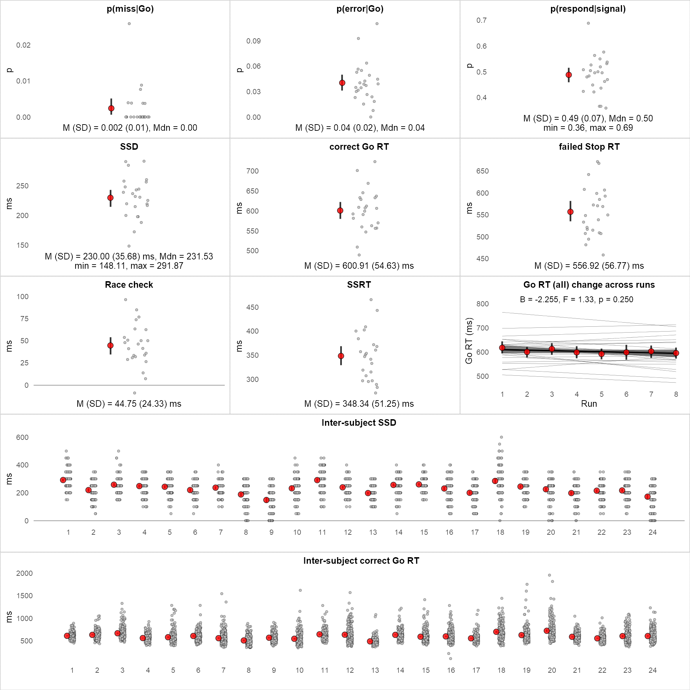


## Think/No-Think task performance

### Summary data and decriptives

#### Per subject


```R
# ==================================================================
# TNT RESULTS
# ==================================================================
# display
# sp - Same probe test
# ip - Independent probe test
# uc - unconditionalised
# c  - conditionalised
options(width = 114)
print(cbind(dataTNT[, 4:10], round(dataTNT[, 11:ncol(dataTNT)], 0)))
```

       cgroup testorder    sex age items learned criterion spTuc spNTuc spBuc spSIFuc ipTuc ipNTuc ipBuc ipSIFuc
    1       A      IPSP Female  19    60      49        82   100     95    95       0    60     45    65      20
    2       B      IPSP Female  22    60      35        58    80     40    60      20    50     50    55       5
    3       B      SPIP   Male  25    60      51        85   100     95   100       5    65     45    70      25
    4       C      IPSP   Male  26    60      51        85    95     90    90       0    55     20    60      40
    5       C      SPIP Female  22    60      54        90    80     85    90       5    45     55    75      20
    6       A      SPIP Female  28    60      34        57    80     70    50     -20    70     55    45     -10
    7       A      IPSP Female  24    60      57        95    95     95    85     -10    40     50    60      10
    8       B      IPSP Female  25    60      39        65    80     60    80      20    65     60    60       0
    9       A      SPIP Female  36    60      38        63    75     80    65     -15    60     65    50     -15
    10      A      IPSP Female  24    60      58        97   100     85   100      15    60     60    70      10
    11      B      SPIP   Male  35    60      25        42    45     35    50      15    35     25    45      20
    12      B      SPIP Female  21    60      25        42    40     25    55      30    65     45    65      20
    13      B      IPSP Female  22    60      56        93   100    100   100       0    65     50    65      15
    14      C      SPIP Female  30    60      40        67    75     75    65     -10    50     45    40      -5
    15      C      SPIP Female  21    60      50        83    85     95    95       0    65     40    75      35
    16      B      IPSP   Male  20    60      29        48    75      0    60      60    45     35    40       5
    17      C      IPSP Female  23    60      51        85   100     85    95      10    65     70    75       5
    18      C      SPIP   Male  22    60      51        85    90     85    95      10    55     65    55     -10
    19      A      SPIP   Male  29    60      32        53    45     50    55       5    35     50    40     -10
    20      A      IPSP Female  25    60      33        55    35     35    35       0    35     45    30     -15
    21      A      SPIP Female  26    60      47        78    90     85    85       0    55     70    55     -15
    22      C      SPIP Female  22    60      35        58    70     70    65      -5    25     35    45      10
    23      B      SPIP   Male  23    60      42        70    80     50    60      10    50     35    45      10
    24      C      IPSP Female  22    60      46        77    70     85    80      -5    25     55    45     -10
       spipTuc spipNTuc spipBuc spipSIFuc spTc spNTc spBc spSIFc ipTc ipNTc ipBc ipSIFc spipTc spipNTc spipBc
    1       80       70      80        10  100   100  100      0   59    56   72     16     79      78     86
    2       65       45      57        12  100    73   85     11   50    73   69     -4     75      73     77
    3       82       70      85        15  100    94  100      6   69    45   71     26     84      69     85
    4       75       55      75        20  100    95   94     -1   57    22   61     39     79      58     78
    5       62       70      82        12   93    94   90     -4   47    56   75     19     70      75     82
    6       75       62      48       -15  100   100   89    -11   76    50   56      6     88      75     72
    7       68       72      72         0  100   100   89    -11   36    53   63     10     68      77     76
    8       72       60      70        10  100    93   93      0   71    71   67     -5     86      82     80
    9       68       72      57       -15   92    94   83    -10   67    75   50    -25     79      84     67
    10      80       72      85        12  100    94  100      6   60    67   70      3     80      81     85
    11      40       30      48        18   71    83   90      7   58    33   70     37     65      58     80
    12      52       35      60        25   92    83  100     17   83    58   73     14     88      71     86
    13      82       75      82         8  100   100  100      0   59    47   65     18     80      74     82
    14      62       60      52        -8  100    87   86     -1   59    54   50     -4     79      70     68
    15      75       68      85        18  100   100  100      0   61    42   81     39     80      71     91
    16      60       18      50        32  100   100  100      0   47    50   44     -6     73      75     72
    17      82       78      85         8  100    95   95      0   70    65   79     14     85      80     87
    18      72       75      75         0  100    87   95      8   56    60   58     -2     78      73     76
    19      40       50      48        -2   80    67   85     18   50    67   46    -21     65      67     65
    20      35       40      32        -8   71    43   58     15   29    64   42    -23     50      54     50
    21      72       78      70        -8   94    93  100      7   56    75   67     -8     75      84     83
    22      48       52      55         2  100    90   91      1    7    48   64     16     54      69     77
    23      65       42      52        10   94    66   92     26   50    46   42     -5     72      56     67
    24      48       70      62        -8   93   100  100      0   29    63   56     -7     61      82     78
       spipSIFc
    1         8
    2         4
    3        16
    4        19
    5         8
    6        -3
    7         0
    8        -2
    9       -18
    10        4
    11       22
    12       16
    13        9
    14       -2
    15       20
    16       -3
    17        7
    18        3
    19       -1
    20       -4
    21        0
    22        9
    23       10
    24       -4
    

#### Group aggregated


```R
# Descriptives
# ----------------------------------------------------------------------
dscrTNT <- stat.desc(dataTNT[, 7:ncol(dataTNT)], basic = TRUE, desc = TRUE, p = 0.95)
options(width = 110)
print(round(dscrTNT, 0))
```

                 age items learned criterion spTuc spNTuc spBuc spSIFuc ipTuc ipNTuc ipBuc ipSIFuc spipTuc
    nbr.val       24    24      24        24    24     24    24      24    24     24    24      24      24
    nbr.null       0     0       0         0     0      1     0       6     0      0     0       1       0
    nbr.na         0     0       0         0     0      0     0       0     0      0     0       0       0
    min           19    60      25        42    35      0    35     -20    25     20    30     -15      35
    max           36    60      58        97   100    100   100      60    70     70    75      40      82
    range         17     0      33        55    65    100    65      80    45     50    45      55      48
    sum          592  1440    1028      1713  1885   1670  1810     140  1240   1170  1330     160    1562
    median        24    60      44        74    80     82    80       2    55     50    55       8      68
    mean          25    60      43        71    79     70    75       6    52     49    55       7      65
    SE.mean        1     0       2         3     4      5     4       3     3      3     3       3       3
    CI.mean.0.95   2     0       4         7     8     11     8       7     6      6     5       7       6
    var           19     0     104       290   390    715   382     269   180    170   167     251     209
    std.dev        4     0      10        17    20     27    20      16    13     13    13      16      14
    coef.var       0     0       0         0     0      0     0       3     0      0     0       2       0
                 spipNTuc spipBuc spipSIFuc spTc spNTc spBc spSIFc ipTc ipNTc ipBc ipSIFc spipTc spipNTc spipBc
    nbr.val            24      24        24   24    24   24     24   24    24   24     24     24      24     24
    nbr.null            0       0         2    0     0    0      5    0     0    0      0      0       0      0
    nbr.na              0       0         0    0     0    0      0    0     0    0      0      0       0      0
    min                18      32       -15   71    43   58    -11    7    22   42    -25     50      54     50
    max                78      85        32  100   100  100     26   83    75   81     39     88      84     91
    range              60      52        48   29    57   42     37   76    53   40     64     38      31     41
    sum              1420    1570       150 2278  2131 2215     84 1307  1341 1490    149   1792    1736   1852
    median             65      66         9  100    94   94      0   58    56   64      4     78      73     78
    mean               59      65         6   95    89   92      3   54    56   62      6     75      72     77
    SE.mean             3       3         3    2     3    2      2    3     3    2      4      2       2      2
    CI.mean.0.95        7       7         5    4     6    4      4    7     6    5      8      4       4      4
    var               279     239       154   78   197   86     84  279   175  136    334    103      75     83
    std.dev            17      15        12    9    14    9      9   17    13   12     18     10       9      9
    coef.var            0       0         2    0     0    0      3    0     0    0      3      0       0      0
                 spipSIFc
    nbr.val            24
    nbr.null            0
    nbr.na              0
    min               -18
    max                22
    range              39
    sum               116
    median              4
    mean                5
    SE.mean             2
    CI.mean.0.95        4
    var                87
    std.dev             9
    coef.var            2
    

### Result plots


```R
# Plot results
# ----------------------------------------------------------------------
options(repr.plot.width = 9, repr.plot.height = 6, repr.plot.res = 200) 

# 1. Unconditionalised SP SIF
p12 <- plotResults(dataTNT, dataTNT$spSIFuc, 1, "SIF (SP)", "%",
                   sprintf("M (SD) = %.0f (%.0f) %%", 
                           dscrTNT["mean","spSIFuc"], dscrTNT["std.dev","spSIFuc"])) + 
      scale_x_discrete() + geom_hline(aes(yintercept = 0), size = 0.1)

# 2. Unconditionalised IP SIF
p13 <- plotResults(dataTNT, dataTNT$ipSIFuc, 1, "SIF (IP)", "%",
                   sprintf("M (SD) = %.0f (%.0f) %%", 
                           dscrTNT["mean","ipSIFuc"], dscrTNT["std.dev","ipSIFuc"])) + 
      scale_x_discrete() + geom_hline(aes(yintercept = 0), size = 0.1)

# 3. Unconditionalised SPIP SIF SP and IP
p14 <- plotResults(dataTNT, dataTNT$spipSIFuc, 1, "SIF (SP and IP)", "%",
                   sprintf("M (SD) = %.0f (%.0f) %%", 
                           dscrTNT["mean","spipSIFuc"], dscrTNT["std.dev","spipSIFuc"])) + 
      scale_x_discrete() + geom_hline(aes(yintercept = 0), size = 0.1)

# 4. Conditionalised SP SIF
p15 <- plotResults(dataTNT, dataTNT$spSIFc, 1, "SIF (SP)", "%",
                   sprintf("M (SD) = %.0f (%.0f) %%", 
                           dscrTNT["mean","spSIFc"], dscrTNT["std.dev","spSIFc"])) + 
      scale_x_discrete() + geom_hline(aes(yintercept = 0), size = 0.1)

# 5. Conditionalised IP SIF
p16 <- plotResults(dataTNT, dataTNT$ipSIFc, 1, "SIF (IP)", "%",
                   sprintf("M (SD) = %.0f (%.0f) %%", 
                           dscrTNT["mean","ipSIFc"], dscrTNT["std.dev","ipSIFc"])) + 
      scale_x_discrete() + geom_hline(aes(yintercept = 0), size = 0.1)

# 6. Conditionalised SIF SP and IP
p17 <- plotResults(dataTNT, dataTNT$spipSIFc, 1, "SIF (SP and IP)", "%",
                   sprintf("M (SD) = %.0f (%.0f) %%", 
                           dscrTNT["mean","spipSIFc"], dscrTNT["std.dev","spipSIFc"])) + 
      scale_x_discrete() + geom_hline(aes(yintercept = 0), size = 0.1) + theme(
  panel.background = element_rect(fill = "lightyellow"))

# 7. Relationship between conditionalised and unconditionalised SIFs
outliers <- get_outliers(dataTNT$spipSIFuc, "unc. SIF", "%", dataTNT$spipSIFc, "cond. SIF", "", disp = FALSE)
corRes <- doCorrelation(dataTNT$spipSIFuc, dataTNT$spipSIFc, outliers)
p18 <- plotCorrelation(dataTNT$spipSIFuc, 
                       dataTNT$spipSIFc,"Uncond. SIF","Cond. SIF",corRes, 1.8, 11, outliers) + 
            geom_vline(aes(xintercept = 0), size = 0.1) + geom_hline(aes(yintercept = 0), size = 0.1)

# 8. % of learned (included in analysis) items
p19 <- plotResults(dataTNT, dataTNT$criterion, 1, "% of learned items", "%",
                   sprintf("M (SD) = %.0f (%.0f) %%\nmin = %.0f, max = %.0f", 
                           dscrTNT["mean","criterion"], dscrTNT["std.dev","criterion"], 
                           dscrTNT["min","criterion"], dscrTNT["max","criterion"])) + 
      scale_x_discrete()

## Put all plots in a grid and display
grid.arrange(arrangeGrob(p12, p13, p14, 
                         top = textGrob("Unconditionalised", gp=gpar(fontface="bold")), nrow = 1), 
             arrangeGrob(p15, p16, p17, 
                         top = textGrob("Conditionalised", gp=gpar(fontface="bold")), nrow = 1),
             arrangeGrob(p18, p19, 
                         top="", layout_matrix = rbind(c(1,1,1,NA,2,2))))
```


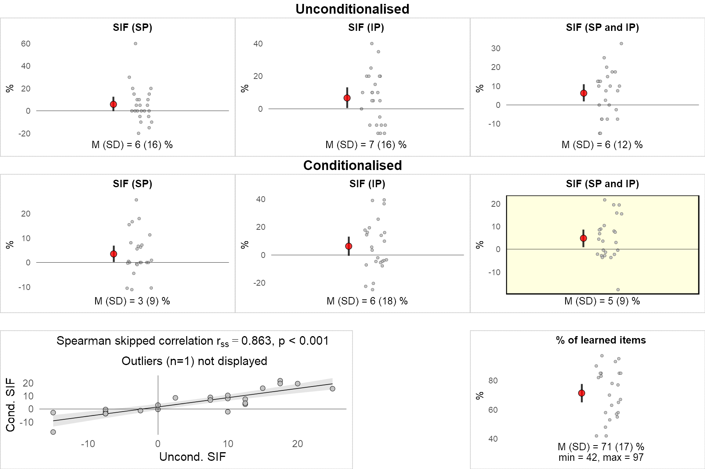


### SIF effect (conditionalised, SP and IP)


```R
# SIF effect (conditionalised, SP and IP)
# ----------------------------------------------------------------------
# http://www.sthda.com/english/wiki/one-sample-t-test-in-r
# Since the sample size is not large enough (less than 30, central limit theorem), we need to check whether 
# the data follow a normal distribution.
# It's possible to use the Shapiro-Wilk normality test and to look at the normality plot.
# 
# Shapiro-Wilk test:
#   Null hypothesis: the data are normally distributed
# Alternative hypothesis: the data are not normally distributed
shapiro.test(dataTNT$spipSIFc)

# SIF data are normally  distributed! Can do t.test. Otherwise would need to to wilcox.test
t.SIFc <- t.test(dataTNT$spipSIFc, mu = 0, alternative = "greater")
t.SIFc
sprintf("SIF effect: t(%d) = %.2f, p = %.3f, d = %.3f", 
        t.SIFc$parameter, t.SIFc$statistic, t.SIFc$p.value, t.SIFc$statistic/sqrt(t.SIFc$parameter+1))

```


    
    	Shapiro-Wilk normality test
    
    data:  dataTNT$spipSIFc
    W = 0.94945, p-value = 0.2636
    


    
    	One Sample t-test
    
    data:  dataTNT$spipSIFc
    t = 2.5519, df = 23, p-value = 0.008912
    alternative hypothesis: true mean is greater than 0
    95 percent confidence interval:
     1.592493      Inf
    sample estimates:
    mean of x 
     4.849436 
    


'SIF effect: t(23) = 2.55, p = 0.009, d = 0.521'


## SSRT and SIF outliers
To identify univariate and bi-variate outliers in the SSRT and SIF scores, we used box plot method, which relies on the interquartile range. Univariate outliers were not present for any of the two measures. One bi-variate outlier was removed from the correlation analysis and the behavioural partial least squares analysis (described below). Nevertheless, outlier removal did not qualitatively alter the results.


```R
# ==================================================================
# SSRT and SIF OUTLIERS
# ==================================================================
SSRT <- dataSSTsubj$SSRT
SIF  <- dataTNT$spSIFc
```

### Outliers with Unconditionalised SIF


```R
options(repr.plot.width = 7, repr.plot.height = 2, repr.plot.res = 200) # change plot size
u_spipOutliers <- get_outliers(dataTNT$spipSIFu, "SP&IP", "%", SSRT, "SSRT", "ms", disp = TRUE)
u_spOutliers   <- get_outliers(dataTNT$spSIFu, "SP", "%", SSRT, "SSRT", "ms", disp = TRUE)
u_ipOutliers   <- get_outliers(dataTNT$ipSIFu, "IP", "%", SSRT, "SSRT", "ms", disp = TRUE)
```

    [1] "SP&IP outliers: 0"
    numeric(0)
    [1] "SSRT outliers: 0"
    numeric(0)
    [1] "Bi-variate outliers: 0"
    numeric(0)
    


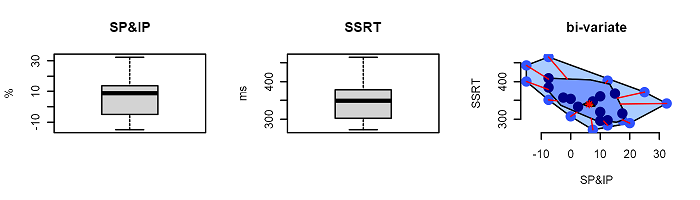


    [1] "SP outliers: 1"
    [1] 16
    [1] "SSRT outliers: 0"
    numeric(0)
    [1] "Bi-variate outliers: 1"
    [1] 16
    


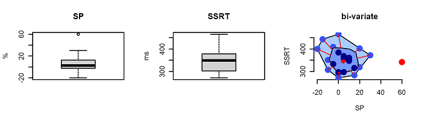


    [1] "IP outliers: 0"
    numeric(0)
    [1] "SSRT outliers: 0"
    numeric(0)
    [1] "Bi-variate outliers: 0"
    numeric(0)
    


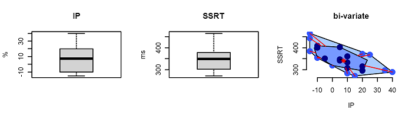


### Outliers with Conditionalised SIF


```R
options(repr.plot.width = 7, repr.plot.height = 2, repr.plot.res = 200) # change plot size
c_spipOutliers <- get_outliers(dataTNT$spipSIFc, "SP&IP", "%", SSRT, "SSRT", "ms", disp = TRUE)
c_spOutliers   <- get_outliers(dataTNT$spSIFc, "SP", "%", SSRT, "SSRT", "ms", disp = TRUE)
c_ipOutliers   <- get_outliers(dataTNT$ipSIFc, "IP", "%", SSRT, "SSRT", "ms", disp = TRUE)
```

    [1] "SP&IP outliers: 0"
    numeric(0)
    [1] "SSRT outliers: 0"
    numeric(0)
    [1] "Bi-variate outliers: 1"
    [1] 9
    


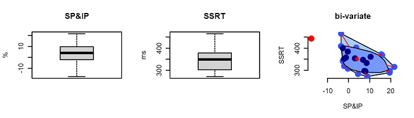


    [1] "SP outliers: 1"
    [1] 23
    [1] "SSRT outliers: 0"
    numeric(0)
    [1] "Bi-variate outliers: 0"
    numeric(0)
    


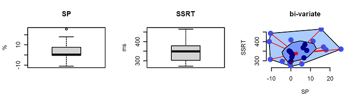


    [1] "IP outliers: 0"
    numeric(0)
    [1] "SSRT outliers: 0"
    numeric(0)
    [1] "Bi-variate outliers: 0"
    numeric(0)
    


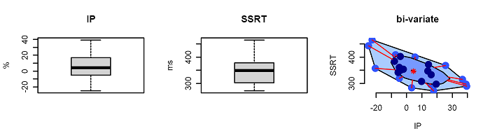


## SSRT and SIF correlation


```R
options(repr.plot.width = 11, repr.plot.height = 6, repr.plot.res = 200) # change plot size
grid.arrange(
  arrangeGrob(
    plotCorrelation(dataTNT$spipSIFu,SSRT,"Inhibiting memories (SP&IP SIF, %)",
                    "Inhibiting actions (SSRT, ms)",
                    doCorrelation(dataTNT$spipSIFu, SSRT, u_spipOutliers),
                    1.8, 11, u_spipOutliers), 
    plotCorrelation(dataTNT$spSIFu,SSRT,"Inhibiting memories (SP SIF, %)",
                    "Inhibiting actions (SSRT, ms)",
                    doCorrelation(dataTNT$spSIFu, SSRT, u_spOutliers),
                    1.8, 11, u_spOutliers), 
    plotCorrelation(dataTNT$ipSIFu,SSRT,"Inhibiting memories (IP SIF, %)",
                    "Inhibiting actions (SSRT, ms)",
                    doCorrelation(dataTNT$ipSIFu, SSRT, u_ipOutliers),
                    1.8, 11, u_ipOutliers), 
    top = textGrob("Unconditionalised", gp=gpar(fontface="bold")), 
    nrow = 1),
  
  arrangeGrob(
    plotCorrelation(dataTNT$spipSIFc,SSRT,"Inhibiting memories (SP&IP SIF, %)",
                    "Inhibiting actions (SSRT, ms)",
                    doCorrelation(dataTNT$spipSIFc, SSRT, c_spipOutliers),
                    1.8, 11, c_spipOutliers) + 
      theme(panel.background = element_rect(fill = "lightyellow")), 
    plotCorrelation(dataTNT$spSIFc,SSRT,"Inhibiting memories (SP SIF, %)",
                    "Inhibiting actions (SSRT, ms)",
                    doCorrelation(dataTNT$spSIFc, SSRT, c_spOutliers),
                    1.8, 11, u_spOutliers), 
    plotCorrelation(dataTNT$ipSIFc,SSRT,"Inhibiting memories (IP SIF, %)",
                    "Inhibiting actions (SSRT, ms)",
                    doCorrelation(dataTNT$ipSIFc, SSRT, c_ipOutliers),
                    1.8, 11, u_ipOutliers),
    top = textGrob("Conditionalised", gp=gpar(fontface="bold")), 
    nrow = 1)
)
```


### Figure 4a


```R
plot.behcor <- plotCorrelation(dataTNT$spipSIFc,SSRT,
                               "Suppression induced forgetting (%)",
                               "Stop-signal reaction time (ms)",
                    doCorrelation(dataTNT$spipSIFc, SSRT, c_spipOutliers),
                    1.8, 11, c_spipOutliers)
# display
options(repr.plot.width = 5, repr.plot.height = 4, repr.plot.res = 250) 
plot.behcor

#save 
ggsave(file="Figure4a.svg", plot.behcor, width=4, height=3)

```


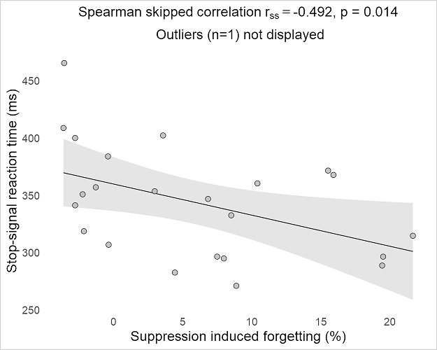


## SSRTs accounting for Stop Trigger Failures


```R
# ==================================================================
# SSRT with Trigger Failures
# ==================================================================
# Descriptives
# ----------------------------------------------------------------------
dscr_tfSSRT <-
  stat.desc(data_tfSSRT,
            basic = TRUE,
            desc = TRUE,
            p = 0.95)
print(round(dscr_tfSSRT, 2))

tfSSRT <- data_tfSSRT$tfSSRT
tf     <- data_tfSSRT$p_tf
```

                    sID  tfSSRT  p_tf
    nbr.val       24.00   24.00 24.00
    nbr.null       0.00    0.00  0.00
    nbr.na         0.00    0.00  0.00
    min            1.00  208.82  0.12
    max           24.00  341.18  0.46
    range         23.00  132.35  0.34
    sum          300.00 6692.16  6.06
    median        12.50  279.01  0.24
    mean          12.50  278.84  0.25
    SE.mean        1.44    8.40  0.02
    CI.mean.0.95   2.99   17.37  0.04
    var           50.00 1691.84  0.01
    std.dev        7.07   41.13  0.09
    coef.var       0.57    0.15  0.34
    

### Outliers
#### Outliers with Unconditionalised SIF


```R
options(repr.plot.width = 7, repr.plot.height = 2) # change plot size
u_spipOutl_tfSSRT <- get_outliers(dataTNT$spipSIFu, "SP&IP", "%", tfSSRT, "tfSSRT", "ms", disp = TRUE)
u_spOutl_tfSSRT   <- get_outliers(dataTNT$spSIFu, "SP", "%", tfSSRT, "tfSSRT", "ms", disp = TRUE)
u_ipOutl_tfSSRT   <- get_outliers(dataTNT$ipSIFu, "IP", "%", tfSSRT, "tfSSRT", "ms", disp = TRUE)
```

    [1] "SP&IP outliers: 0"
    numeric(0)
    [1] "tfSSRT outliers: 0"
    numeric(0)
    [1] "Bi-variate outliers: 0"
    numeric(0)
    


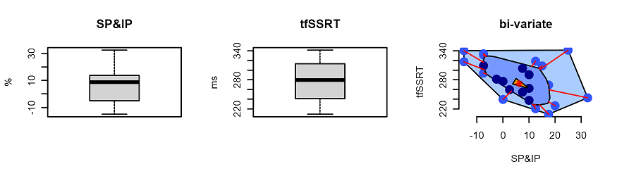


    [1] "SP outliers: 1"
    [1] 16
    [1] "tfSSRT outliers: 0"
    numeric(0)
    [1] "Bi-variate outliers: 1"
    [1] 16
    


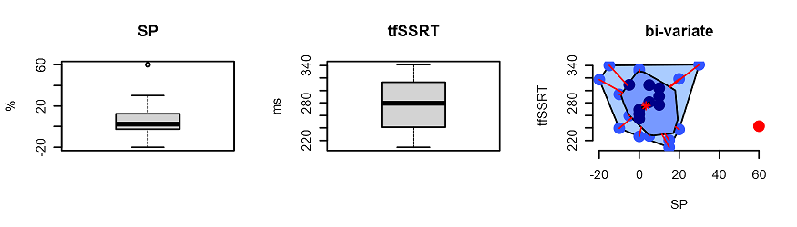


    [1] "IP outliers: 0"
    numeric(0)
    [1] "tfSSRT outliers: 0"
    numeric(0)
    [1] "Bi-variate outliers: 0"
    numeric(0)
    


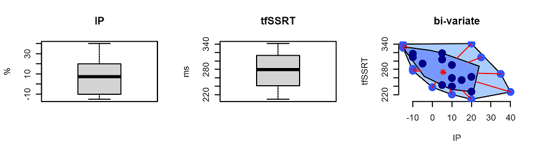


#### Outliers with Conditionalised SIF


```R
options(repr.plot.width = 7, repr.plot.height = 2) # change plot size
c_spipOutl_tfSSRT <- get_outliers(dataTNT$spipSIFc, "SP&IP", "%", tfSSRT, "tfSSRT", "ms", disp = TRUE)
c_spOutl_tfSSRT   <- get_outliers(dataTNT$spSIFc, "SP", "%", tfSSRT, "tfSSRT", "ms", disp = TRUE)
c_ipOutl_tfSSRT   <- get_outliers(dataTNT$ipSIFc, "IP", "%", tfSSRT, "tfSSRT", "ms", disp = TRUE)
```

    [1] "SP&IP outliers: 0"
    numeric(0)
    [1] "tfSSRT outliers: 0"
    numeric(0)
    [1] "Bi-variate outliers: 0"
    numeric(0)
    


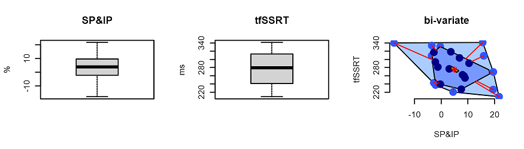


    [1] "SP outliers: 1"
    [1] 23
    [1] "tfSSRT outliers: 0"
    numeric(0)
    [1] "Bi-variate outliers: 2"
    [1] 6 9
    


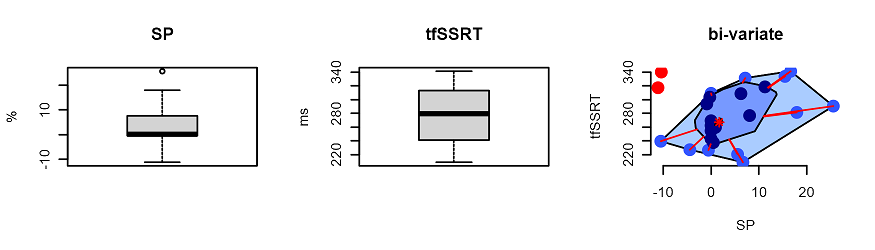


    [1] "IP outliers: 0"
    numeric(0)
    [1] "tfSSRT outliers: 0"
    numeric(0)
    [1] "Bi-variate outliers: 0"
    numeric(0)
    


### tfSSRT and SIF correlation


```R
options(repr.plot.width = 11, repr.plot.height = 6, repr.plot.res = 200) # change plot size
grid.arrange(
  arrangeGrob(
    plotCorrelation(dataTNT$spipSIFu,tfSSRT,"Inhibiting memories (SP&IP SIF, %)",
                    "Inhibiting actions (SSRT, ms)",
                    doCorrelation(dataTNT$spipSIFu, tfSSRT, u_spipOutl_tfSSRT),
                    1.8, 11, u_spipOutl_tfSSRT), 
    plotCorrelation(dataTNT$spSIFu,tfSSRT,"Inhibiting memories (SP SIF, %)",
                    "Inhibiting actions (SSRT, ms)",
                    doCorrelation(dataTNT$spSIFu, tfSSRT, u_spOutl_tfSSRT),
                    1.8, 11, u_spOutl_tfSSRT), 
    plotCorrelation(dataTNT$ipSIFu,tfSSRT,"Inhibiting memories (IP SIF, %)",
                    "Inhibiting actions (SSRT, ms)",
                    doCorrelation(dataTNT$ipSIFu, tfSSRT, u_ipOutl_tfSSRT),
                    1.8, 11, u_ipOutl_tfSSRT), 
    top = textGrob("Unconditionalised", gp=gpar(fontface="bold")), 
    nrow = 1),
  
  arrangeGrob(
    plotCorrelation(dataTNT$spipSIFc,tfSSRT,"Inhibiting memories (SP&IP SIF, %)",
                    "Inhibiting actions (SSRT, ms)",
                    doCorrelation(dataTNT$spipSIFc, tfSSRT, c_spipOutl_tfSSRT),
                    1.8, 11, c_spipOutl_tfSSRT) + 
      theme(panel.background = element_rect(fill = "lightyellow")), 
    plotCorrelation(dataTNT$spSIFc,tfSSRT,"Inhibiting memories (SP SIF, %)",
                    "Inhibiting actions (SSRT, ms)",
                    doCorrelation(dataTNT$spSIFc, tfSSRT, c_spOutl_tfSSRT),
                    1.8, 11, u_spOutl_tfSSRT), 
    plotCorrelation(dataTNT$ipSIFc,tfSSRT,"Inhibiting memories (IP SIF, %)",
                    "Inhibiting actions (SSRT, ms)",
                    doCorrelation(dataTNT$ipSIFc, tfSSRT, c_ipOutl_tfSSRT),
                    1.8, 11, u_ipOutl_tfSSRT),
    top = textGrob("Conditionalised", gp=gpar(fontface="bold")), 
    nrow = 1)
)
```


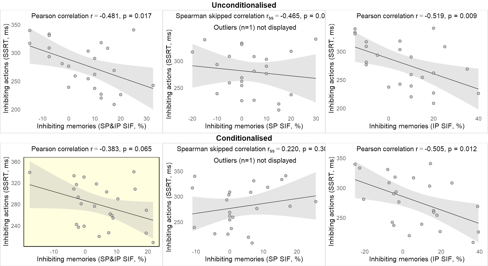


## Trigger Failure and SSRT correlation


```R
options(repr.plot.width = 5, repr.plot.height = 3, repr.plot.res = 200) # change plot size
ssrt.tf.outl <- get_outliers(SSRT, "SSRT", "%", tf, "TF", "p", disp = FALSE)


plotCorrelation(SSRT,tf,"SSRT","Stop trigger failures (p)",
                    doCorrelation(SSRT, tf, ssrt.tf.outl),
                    1.8, 11, ssrt.tf.outl)

```


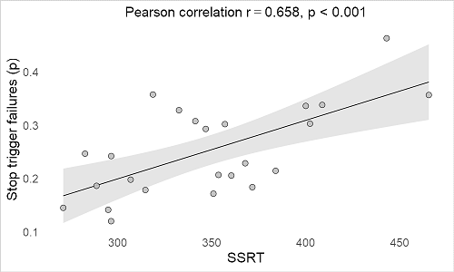


## Trigger Failure and SIF correlation

### Outliers
#### Ouliers with Unconditionalised SIF


```R
options(repr.plot.width = 7, repr.plot.height = 2, repr.plot.res = 200) # change plot size
u_spipOutl_tf <- get_outliers(dataTNT$spipSIFu, "SP&IP", "%", tf, "TF", "p", disp = FALSE)
u_spOutl_tf   <- get_outliers(dataTNT$spSIFu, "SP", "%", tf, "TF", "p", disp = FALSE)
u_ipOutl_tf   <- get_outliers(dataTNT$ipSIFu, "IP", "%", tf, "TF", "p", disp = FALSE)
```

#### Outliers with Conditionalised SIF


```R
options(repr.plot.width = 7, repr.plot.height = 2, repr.plot.res = 200) # change plot size
c_spipOutl_tf <- get_outliers(dataTNT$spipSIFc, "SP&IP", "%", tf, "TF", "p", disp = FALSE)
c_spOutl_tf   <- get_outliers(dataTNT$spSIFc, "SP", "%", tf, "TF", "p", disp = FALSE)
c_ipOutl_tf   <- get_outliers(dataTNT$ipSIFc, "IP", "%", tf, "TF", "p", disp = FALSE)
```

### Correlation


```R
options(repr.plot.width = 11, repr.plot.height = 6, repr.plot.res = 200) # change plot size
grid.arrange(
  arrangeGrob(
    plotCorrelation(dataTNT$spipSIFu,tf,"Inhibiting memories (SP&IP SIF, %)","Stop trigger failures (p)",
                    doCorrelation(dataTNT$spipSIFu, tf, u_spipOutl_tf),
                    1.8, 11, u_spipOutl_tf), 
    plotCorrelation(dataTNT$spSIFu,tf,"Inhibiting memories (SP SIF, %)","Stop trigger failures (p)",
                    doCorrelation(dataTNT$spSIFu, tf, u_spOutl_tf),
                    1.8, 11, u_spOutl_tf), 
    plotCorrelation(dataTNT$ipSIFu,tf,"Inhibiting memories (IP SIF, %)","Stop trigger failures (p)",
                    doCorrelation(dataTNT$ipSIFu, tf, u_ipOutl_tf),
                    1.8, 11, u_ipOutl_tf), 
    top = textGrob("Unconditionalised", gp=gpar(fontface="bold")), 
    nrow = 1),
  
  arrangeGrob(
    plotCorrelation(dataTNT$spipSIFc,tf,"Inhibiting memories (SP&IP SIF, %)","Stop trigger failures (p)",
                    doCorrelation(dataTNT$spipSIFc, tf, c_spipOutl_tf),
                    1.8, 11, c_spipOutl_tf) + theme(panel.background = element_rect(fill = "lightyellow")), 
    plotCorrelation(dataTNT$spSIFc,tf,"Inhibiting memories (SP SIF, %)","Stop trigger failures (p)",
                    doCorrelation(dataTNT$spSIFc, tf, c_spOutl_tf),
                    1.8, 11, u_spOutl_tf), 
    plotCorrelation(dataTNT$ipSIFc,tf,"Inhibiting memories (IP SIF, %)","Stop trigger failures (p)",
                    doCorrelation(dataTNT$ipSIFc, tf, c_ipOutl_tf),
                    1.8, 11, u_ipOutl_tf),
    top = textGrob("Conditionalised", gp=gpar(fontface="bold")), 
    nrow = 1)
)
```


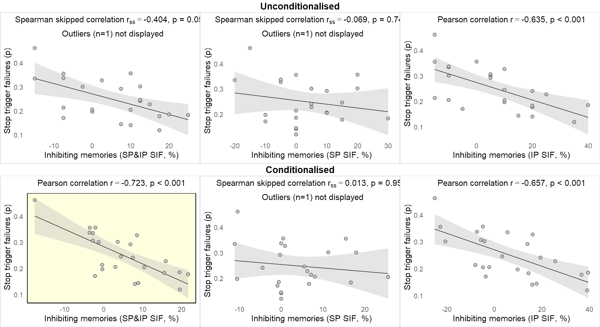


# Brain-behaviour correlation


```R
# ----------------------------------------------------------------------
# GET THE DATA
# ----------------------------------------------------------------------
# Load
plsdata <-
 read.csv('https://raw.githubusercontent.com/dcdace/tmp/master/data/pls_brain_scores.csv')
plsdata <- plsdata
plsdata$SSRT <- SSRT 
plsdata$SIF <- dataTNT$spipSIFc 

pls.ssrt.outl <- get_outliers(plsdata$SSRT, "SSRT", "ms", 
                              plsdata$BrainScores, "Brain scores", "", disp = FALSE)
pls.sif.outl <- get_outliers(plsdata$SIF, "SIF", "%", 
                             plsdata$BrainScores, "Brain scores", "", disp = FALSE)

plot.pls.ssrt <- plotCorrelation(plsdata$SSRT, plsdata$BrainScores,
                "SSRT", "Brain scores",
                    doCorrelation(plsdata$SSRT, plsdata$BrainScores, pls.ssrt.outl),
                    1.8, 14, pls.ssrt.outl, FALSE)

plot.pls.sif <- plotCorrelation(plsdata$SIF, plsdata$BrainScores,
                "SIF", "Brain scores",
                    doCorrelation(plsdata$SIF, plsdata$BrainScores, pls.sif.outl),
                    1.8, 14, pls.sif.outl, FALSE)

options(repr.plot.width = 9, repr.plot.height = 3, repr.plot.res = 200) 
grid.arrange(plot.pls.ssrt, plot.pls.sif, nrow = 1)
```


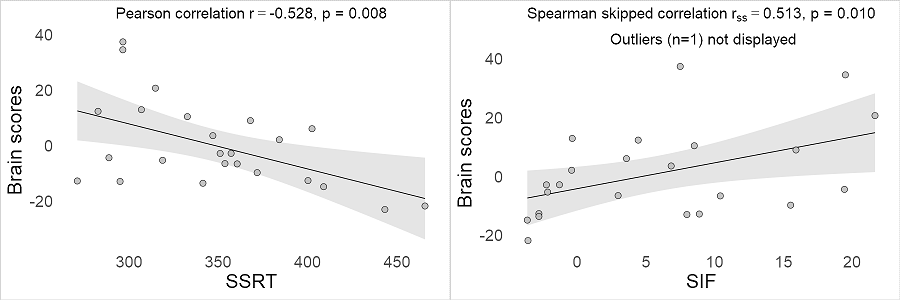


# ROI analysis: inhibitory targets, hippocampus and M1

## Load the data


```R
# ----------------------------------------------------------------------
# GET THE DATA
# ----------------------------------------------------------------------
# Load
data <-
 read.csv('https://raw.githubusercontent.com/dcdace/tmp/master/data/targetROIs_psc.csv')
data[, 4:9] = data[, 4:9]-data[, 4]
# Have a look what it contains
head(data,1)
cat('rois: ')
cat(unique(data$roi))
cat('\nconditions: ')
cat(unique(data$condition))
```


<table>
<caption>A data.frame: 1 × 9</caption>
<thead>
	<tr><th></th><th scope=col>sid</th><th scope=col>roi</th><th scope=col>condition</th><th scope=col>X0s</th><th scope=col>X2s</th><th scope=col>X4s</th><th scope=col>X6s</th><th scope=col>X8s</th><th scope=col>X10s</th></tr>
	<tr><th></th><th scope=col>&lt;chr&gt;</th><th scope=col>&lt;chr&gt;</th><th scope=col>&lt;chr&gt;</th><th scope=col>&lt;dbl&gt;</th><th scope=col>&lt;dbl&gt;</th><th scope=col>&lt;dbl&gt;</th><th scope=col>&lt;dbl&gt;</th><th scope=col>&lt;dbl&gt;</th><th scope=col>&lt;dbl&gt;</th></tr>
</thead>
<tbody>
	<tr><th scope=row>1</th><td>T_475</td><td>rHC</td><td>nt</td><td>0</td><td>-0.103206</td><td>-0.3974229</td><td>-0.244294</td><td>0.1712856</td><td>0.3940649</td></tr>
</tbody>
</table>


    rois: rHC lM1
    conditions: nt t s g

## ROI x Modality interaction

### Prepare the data


```R
# ----------------------------------------------------------------------
# ROI x MODALITY INTERACTION
# ----------------------------------------------------------------------
# Create Inhibit (NT & Stop) and Express (T & Go) subsets 
dataInh <- subset(data, (condition == 'nt' | condition == 's'))
dataExp <- subset(data, (condition == 't' | condition == 'g'))

# Substract Express from Inhibit
dataModality <- cbind(dataInh[, 1:3], dataInh[, 4:9] - dataExp[, 4:9])

dataModality$condition <- as.factor(dataModality$condition)
# Change conditions to the corresponding Modality
dataModality$condition <-
  revalue(dataModality$condition, c("nt" = "nt_t", "s" = "s_g"))
names(dataModality)[names(dataModality) == 'condition'] <-
  'modality'

# Average PSC within a timespan of 2-6s and substracting the onset value to account for pretrial variability.
# Similar as in Levy&Anderson, 2012 (they did 4-8s)
dataModality$PSC <- rowMeans(dataModality[, 5:7]) #-dataModality[, 4]

# Change the Type levels to better reflect the data content
dataModality$modality <- factor(dataModality$modality,
                               levels = c("nt_t", "s_g"),
                               labels = c("No-Think - Think", "Stop - Go"))

# See what dataModality contains now
head(dataModality,1)
levels(dataModality$modality)
```


<table>
<caption>A data.frame: 1 × 10</caption>
<thead>
	<tr><th></th><th scope=col>sid</th><th scope=col>roi</th><th scope=col>modality</th><th scope=col>X0s</th><th scope=col>X2s</th><th scope=col>X4s</th><th scope=col>X6s</th><th scope=col>X8s</th><th scope=col>X10s</th><th scope=col>PSC</th></tr>
	<tr><th></th><th scope=col>&lt;chr&gt;</th><th scope=col>&lt;chr&gt;</th><th scope=col>&lt;fct&gt;</th><th scope=col>&lt;dbl&gt;</th><th scope=col>&lt;dbl&gt;</th><th scope=col>&lt;dbl&gt;</th><th scope=col>&lt;dbl&gt;</th><th scope=col>&lt;dbl&gt;</th><th scope=col>&lt;dbl&gt;</th><th scope=col>&lt;dbl&gt;</th></tr>
</thead>
<tbody>
	<tr><th scope=row>1</th><td>T_475</td><td>rHC</td><td>No-Think - Think</td><td>0</td><td>-0.09364885</td><td>-0.3832861</td><td>-0.08235183</td><td>0.3822834</td><td>0.5217001</td><td>-0.1864289</td></tr>
</tbody>
</table>


<style>
.list-inline {list-style: none; margin:0; padding: 0}
.list-inline>li {display: inline-block}
.list-inline>li:not(:last-child)::after {content: "\00b7"; padding: 0 .5ex}
</style>
<ol class=list-inline><li>'No-Think - Think'</li><li>'Stop - Go'</li></ol>


### Run 2x2 ANOVA


```R
# Using rm_2by2_anova.R function from https://raw.githubusercontent.com/dcdace/R_functions/

# Specify columns of interest
columns <- list(
  sID = "sid",     # subject ID
  DV  = "PSC", # dependent variable
  Fc1 = "modality",      # within-subj factor 1
  Fc2 = "roi"   # within-subj factor 2
)
# Define plot label names, tilte, colors and error bar type
param <- list(
  y.label    = "% signal change difference",
  Fc1.label  = "Modality",
  Fc2.label  = "Target region",
  cat.color  = c('red', '#ffc000'), 
  errorbar   = 'se'   
)
# the plot title
param$title <- sprintf('%s x %s interaction', param$Fc2.label, param$Fc1.label)

# Run the ANOVA function but don't display the printouts
anova.results <- hush(rm_2by2_anova(dataModality, columns, param))
```

### Target region x Modality interaction plot


```R
# Adding post-hoc comparison stars
# Prepare the values

# post-hoc pairwise comparisons for each Fc1 level between the Fc2 levels
p.Fc1.L1 <-
  ifelse(anova.results$pwc1$p[1] < 0.05, stars.pval(anova.results$pwc1$p[1]), "n.s.")
p.Fc1.L2 <-
  ifelse(anova.results$pwc1$p[2] < 0.05, stars.pval(anova.results$pwc1$p[2]), "n.s.")

# add horizontal line behind the plot
anova.results$plot.anova$layers <- c(geom_hline(aes(yintercept = 0), size = 0.1), # the new layer
                               anova.results$plot.anova$layers) # original layers
# add other things
plot.targetrois <- anova.results$plot.anova + 
# Add post-hoc pairwise comparisons
  # might need to adjust the x and y positions
  annotate(
    "text",
    x = 1.38,
    y = -0.06,
    label = p.Fc1.L1,
    color = param$cat.color[1],
    size = 8
  ) +
  annotate(
    "text",
    x = 1.6,
    y = -0.15,
    label = p.Fc1.L2,
    color = param$cat.color[2],
    size = 8
  ) +
 # Change ROI captions
 scale_x_discrete(limits = c("rHC", "lM1"), label = c('Hippocampus', 'M1')) 
```

#### Figure 5a


```R
#display
options(repr.plot.width = 5, repr.plot.height = 4, repr.plot.res = 200) # change plot size
plot.targetrois
#save
ggsave(file="Figure5a.pdf", plot.targetrois, width=5, height=4)

```


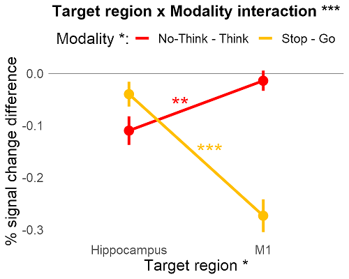


### Interaction results


```R
summary.anova <- summary(anova.results$res.anova)

res.txt.anova <- sprintf(
  '%s: F(%d,%d) = %.2f, p = %.7f',
  param$title,
  summary.anova[["Error: sID:Fc1:Fc2"]][[1]][["Df"]][1],
  summary.anova[["Error: sID:Fc1:Fc2"]][[1]][["Df"]][2],
  summary.anova[["Error: sID:Fc1:Fc2"]][[1]][["F value"]][1],
  summary.anova[["Error: sID:Fc1:Fc2"]][[1]][["Pr(>F)"]][1]
)
cat('\n================================================\n\n')
cat(res.txt.anova)
cat('\n\n================================================')
```

    
    ================================================
    
    Target region x Modality interaction: F(1,23) = 45.99, p = 0.0000006
    
    ================================================

### Main effects


```R
# Main effect of Modality
cat('Main effect of Modality')
anova.results$one.way1

# Main effect of Target region
cat('Main effect of Target region')
anova.results$one.way2
```

    Main effect of Modality


<table>
<caption>A anova_test: 1 × 7</caption>
<thead>
	<tr><th></th><th scope=col>Effect</th><th scope=col>DFn</th><th scope=col>DFd</th><th scope=col>F</th><th scope=col>p</th><th scope=col>p&lt;.05</th><th scope=col>ges</th></tr>
	<tr><th></th><th scope=col>&lt;chr&gt;</th><th scope=col>&lt;dbl&gt;</th><th scope=col>&lt;dbl&gt;</th><th scope=col>&lt;dbl&gt;</th><th scope=col>&lt;dbl&gt;</th><th scope=col>&lt;chr&gt;</th><th scope=col>&lt;dbl&gt;</th></tr>
</thead>
<tbody>
	<tr><th scope=row>1</th><td>Fc1</td><td>1</td><td>47</td><td>6.695</td><td>0.013</td><td>*</td><td>0.076</td></tr>
</tbody>
</table>


    Main effect of Target region


<table>
<caption>A anova_test: 1 × 7</caption>
<thead>
	<tr><th></th><th scope=col>Effect</th><th scope=col>DFn</th><th scope=col>DFd</th><th scope=col>F</th><th scope=col>p</th><th scope=col>p&lt;.05</th><th scope=col>ges</th></tr>
	<tr><th></th><th scope=col>&lt;chr&gt;</th><th scope=col>&lt;dbl&gt;</th><th scope=col>&lt;dbl&gt;</th><th scope=col>&lt;dbl&gt;</th><th scope=col>&lt;dbl&gt;</th><th scope=col>&lt;chr&gt;</th><th scope=col>&lt;dbl&gt;</th></tr>
</thead>
<tbody>
	<tr><th scope=row>1</th><td>Fc2</td><td>1</td><td>47</td><td>4.321</td><td>0.043</td><td>*</td><td>0.04</td></tr>
</tbody>
</table>


### Downregulation of Hippocampus vs M1 for Memory modality


```R
res.txt.ntt <- sprintf(
  't(%d) = %.2f, p = %.3f, d = %.3f',
  anova.results$pwc1[1,]$df,
  abs(anova.results$pwc1[1,]$statistic),
  anova.results$pwc1[1,]$p,
  abs(anova.results$pwc1[1,]$statistic / sqrt(anova.results$pwc1[1,]$df + 1))
)

cat(res.txt.ntt)
```

    t(23) = 3.53, p = 0.002, d = 0.720

### Downregulation of Hippocampus vs M1 for Action modality


```R
res.txt.sg <- sprintf(
  't(%d) = %.2f, p = %.5f, d = %.3f',
  anova.results$pwc1[2,]$df,
  abs(anova.results$pwc1[2,]$statistic),
  anova.results$pwc1[2,]$p,
  abs(anova.results$pwc1[2,]$statistic / sqrt(anova.results$pwc1[1,]$df + 1))
)

cat(res.txt.sg)
```

    t(23) = 6.26, p = 0.00000, d = 1.279

## Below baseline activity in Hippocampus and M1

### Prepare the data 


```R
# Convert to long form
dataLong <- gather(data, seconds, psc, X0s:X10s, factor_key = TRUE)

dataLong$inhibit <-
  as.factor(ifelse((
    dataLong$condition == 's' | dataLong$condition == 'nt'
  ), 1, 0))

# Subsets for each of the 4 levels

# rHC T & NT
dataLong.rHCTNT <-
  subset(dataLong, roi == 'rHC' &
           (condition == 't' | condition == 'nt'))
# rHC Stop & Go
dataLong.rHCSG <-
  subset(dataLong, roi == 'rHC' &
           (condition == 'g' | condition == 's'))
# lM1 T & NT
dataLong.lM1TNT <-
  subset(dataLong, roi == 'lM1' &
           (condition == 't' | condition == 'nt'))
# lM1 Stop & Go
dataLong.lM1SG <-
  subset(dataLong, roi == 'lM1' &
           (condition == 'g' | condition == 's'))
```

### Plotting function


```R
# ----------------------------------------------------------------------
# PLOT FIRs
# ----------------------------------------------------------------------
plotFirs <- function(dataset, labelstxt, title) {
  # aggregate
  res <-
    summarySEwithin(
      dataset,
      measurevar = "psc",
      withinvars = c("seconds", "inhibit"),
      idvar = "sid",
      na.rm = TRUE,
      conf.interval = 0.95
    )
  # plot
  ggplot(data = res, aes(x = seconds, y = psc, group = inhibit)) +
    geom_hline(aes(yintercept = 0), size = 0.2) +
    geom_line(size = 1.5, aes(color = inhibit)) +
    geom_ribbon(
      aes(
        ymin = psc - se,
        ymax = psc + se,
        x = seconds,
        fill = inhibit
      ),
      alpha = 0.3,
      show.legend = FALSE
    ) +
    geom_line(aes(x = seconds, y = psc - se, color = inhibit), size = 0.2) +
    geom_line(aes(x = seconds, y = psc + se, color = inhibit), size = 0.2) +
    scale_color_manual(labels = labelstxt, values = c('green', 'blue')) +
    scale_fill_manual(values = c('#14b814', '#2e599e')) +
    scale_x_discrete(labels = c("0", "2", "4", "6", "8", "10")) +
    labs(x = "Peristimulus time (s)", y = "% signal change") +
    ggtitle(title) +
    guides(color = guide_legend("")) +
    theme_minimal() +
    theme(
      legend.position = "top",
      text = element_text(size = 20),
      plot.title = element_text(
        hjust = 0.5,
        size = 20,
        face = "bold"
      ),
      panel.grid.major = element_blank(),
      panel.grid.minor = element_blank()
    )
}
```

### Add annotations to the plots


```R
# ----------------------------------------------------------------------
# M1: Stop/Go Plot
# ----------------------------------------------------------------------
p.gs <- plotFirs(dataLong.lM1SG, c("Go", "Stop"), "Go/Stop, M1")

# Add one-tailed significance for > or < baseline
lm1s     <- subset(data, roi == 'lM1' & condition == 's')
lm1s$PSC <- rowMeans(lm1s[, 5:8])
p.lm1s   <- stars.pval(sapply(c(5:8), function(x) {
  t.test(lm1s[, x], mu = 0, alternative = c("less"))$p.value
}))
lm1g     <- subset(data, roi == 'lM1' & condition == 'g')
lm1g$PSC <- rowMeans(lm1s[, 5:8])
p.lm1g   <- stars.pval(sapply(c(5:8), function(x) {
  t.test(lm1g[, x], mu = 0, alternative = c("greater"))$p.value
}))

# position the significance stars
sstypos <-
  summarySEwithin(
    dataLong.lM1SG,
    measurevar = "psc",
    withinvars = c("seconds", "inhibit"),
    idvar = "sid",
    na.rm = TRUE,
    conf.interval = 0.95
  )

# add significance stars to the plot
p.gs <- p.gs +
  annotate("text", y = min(sstypos$psc) - mean(sstypos$ci), 
           x = 2:5, label = p.lm1s, size = 10, color = "blue"
  ) +
  annotate(
    "text", y = max(sstypos$psc) + mean(sstypos$ci), 
      x = 2:5, label = p.lm1g, size = 10, color = "green")

# ----------------------------------------------------------------------
# Hippocampus: T/NT Plot
# ----------------------------------------------------------------------
p.tnt <- plotFirs(dataLong.rHCTNT, c("Think", "No-Think"), "Think/No-Think, Hippocampus")

# Add one-tailed significance for > or < baseline
rhcnt     <- subset(data, roi == 'rHC' & condition == 'nt')
rhcnt$PSC <- rowMeans(rhcnt[, 5:8])
p.rhcnt   <- stars.pval(sapply(c(5:8), function(x) {
  t.test(rhcnt[, x], mu = 0, alternative = c("less"))$p.value
}))

rhct      <- subset(data, roi == 'rHC' & condition == 't')
rhct$PSC  <- rowMeans(rhct[, 5:8])
p.rhct    <- stars.pval(sapply(c(5:8), function(x) {
  t.test(rhct[, x], mu = 0, alternative = c("greater"))$p.value
}))

# position the significance stars
tntypos <-
  summarySEwithin(
      dataLong.rHCTNT, 
      measurevar = "psc", 
      withinvars = c("seconds", "inhibit"),
      idvar = "sid", 
      na.rm = TRUE, 
      conf.interval = 0.95)

# add significance stars to the plot
p.tnt <- p.tnt +
  annotate(
    "text", y = min(tntypos$psc) - mean(tntypos$ci), 
      x = 2:5, label = p.rhcnt,size = 10, color = "blue"
  ) +
  annotate("text", y = max(tntypos$psc) + mean(tntypos$ci), 
           x = 2:5, label = p.rhct, size = 10, color = "green"
  )
```

### Figure 5b


```R
#display
options(repr.plot.width = 15, repr.plot.height = 5, repr.plot.res = 200)
plot.firs <- grid.arrange(p.gs, p.tnt, nrow=1)

#save 
ggsave(file="Figure5b_gs.pdf", p.gs, width = 6, height = 3)
ggsave(file="Figure5b_tnt.pdf", p.tnt, width = 6, height = 3)
```


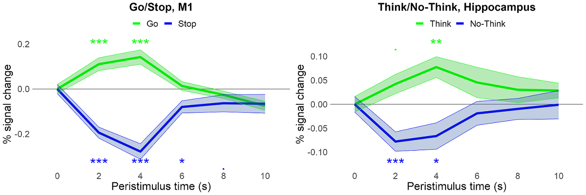


### M1 below baseline during Stop


```R
data.s.lM1 = subset(data, condition == "s" & roi == "lM1")
data.s.lM1$PSC <- rowMeans(data.s.lM1[, 5:7]) - data.s.lM1[, 4]
tt_sm1 <- t.test(data.s.lM1$PSC, mu = 0, alternative = "less")

cat(sprintf('t(%d) = %.2f, p = %.4f, d = %.3f', 
        tt_sm1$parameter,
        tt_sm1$statistic,
        tt_sm1$p.value,
        abs(tt_sm1$statistic/sqrt(tt_sm1$parameter+1))
))
```

    t(23) = -5.08, p = 0.0000, d = 1.037

### Hippocampus below baseline during No-Think


```R
data.nt.rHC = subset(data, condition == "nt" & roi == "rHC")
data.nt.rHC$PSC <- rowMeans(data.nt.rHC[, 5:7]) - data.nt.rHC[, 4]
tt_nthc <- t.test(data.nt.rHC$PSC, mu = 0, alternative = "less")

cat(sprintf('t(%d) = %.2f, p = %.3f, d = %.3f', 
        tt_nthc$parameter,
        tt_nthc$statistic,
        tt_nthc$p.value,
        abs(tt_nthc$statistic/sqrt(tt_nthc$parameter+1))
))
```

    t(23) = -2.23, p = 0.018, d = 0.455

# Pattern classification results

## Data and functions


```R
# ----------------------------------------------------------------------
# GET THE DATA
# ----------------------------------------------------------------------
df <-
  read.csv(
    'https://raw.githubusercontent.com/dcdace/tmp/master/data/cross_decoding.csv',
    fileEncoding = "UTF-8-BOM"
  )

df$acc <- df$acc*100

df$roi  <- factor(df$roi, levels=c('rdlpfc', 'rvlpfc', 'rHC', 'lM1'))
#df$type <- factor(df$type, levels=c('d_specific', 'd_general'))

rois  <- levels(df$roi)
nrois <- length(rois)

# CREATE SUBSETS
# ------------------------------------
# Action domain decoding
action <- subset(df, df$type == 'ss') 

# Thought domain decoding
thought <- subset(df, df$type == 'ntnt') 

# Within-domain decoding
# 1) Train: NT, T; Test: NT=NT
# 2) Train: Stop, Go; Test: Stop=Stop
# average both
within <- subset(df, df$type == 'within_d') 

# Inhibition decoding, domain-special 
# Train: NT, Stop; Test: NT<->Stop
specific <- subset(df, df$type == 'd_specific') 

# Cross-decoding, domain-general
# 1) Train: Stop,Go; Test: NT,T
# 2) Train: NT,T; Test: Stop,Go
# average both
general <- subset(df, df$type == 'd_general') 

# Cross Action-to-Thought
# Train: Stop,Go; Test: NT=Stop
a_to_t <- subset(df, df$type == 'action_to_thought') 

# Cross Thought-to-Action
# Train: NT,T; Test: Stop=NT
t_to_a <- subset(df, df$type == 'thought_to_action')  
```


```R
# TWO DOMAIN PLOTS AND STATS
two_domain_analysis <-
  function(data, color1, color2, name1, name2, plottitle) {
      
    # Within-Subject summary for errorbars
    dataSummary <- summarySEwithin(
      data,
      measurevar = "acc",
      withinvars = c("roi", "type"),
      idvar = "sid",
      na.rm = TRUE,
      conf.interval = 0.95
    )
    
    # PLOT
    # ------------------------------------
    plot.mvpa <-
      ggplot(data = data, aes(x = roi, y = acc, group = type)) +
      geom_hline(aes(yintercept = 50), size = 0.2) +
      
      geom_point(
        colour = "black", alpha = .5, aes(fill = type), size = 2, stroke = 0.5, shape = 21,
        position = position_jitterdodge()
      ) +
      
      geom_pointrange(
        data = dataSummary,
        aes(y = acc, ymin = acc - se, ymax = acc + se, fill = type
        ),
        alpha = 1, color = "black", size = 1.5, stroke = 0.5, shape = 21,
        position = position_dodge(width = .2),
        show.legend = FALSE
      ) +
      
      scale_fill_manual(
        values = c(color1, color2),
        name = "",
        labels = c(name1, name2),
        guide = guide_legend(
          override.aes = list(
            alpha = 1, color = "black", size = 5.5, stroke = 0.5, shape = 21
          )
        )
      ) +
      
      scale_y_continuous(limits = c(min(data$acc) - sd(data$acc), max(data$acc)),
                         breaks = seq(0, 100, 20)) +
      
      labs(x = "", y = "Classification accuracy (%)") + ggtitle(plottitle) +
      
      scale_x_discrete(labels = c("rDLPFC", "rVLPFC", "Hippocampus", "M1")) +
      
      theme_minimal() +
      
      theme(
        text = element_text(size = 22),
        plot.title = element_text(
          size = 20, face = "bold", hjust = 0.5
        ),
        panel.grid.major = element_blank(),
        panel.grid.minor = element_blank(),
        legend.position = "top"
      )
    
    # ADD STATS
    # ------------------------------------
    
    # One-sample t-test, > 50%, Bonf. corrected for 4 ROIs
    
    stat.test <- data %>%
      group_by(roi, type) %>%
      t_test(acc ~ 1, mu = 50, alternative = "greater") %>%
      adjust_pvalue() %>%
      mutate(y.position = 20)
    
    stat.test$stars <-
      stars.pval(ifelse(stat.test$p * 4 > 1, 1, stat.test$p * 4))
    stat.test$colors <-
      ifelse(stat.test$type == "d_general" | 
             stat.test$type == "action_to_thought" | 
             stat.test$type == "thought_to_action", 
             color2, color1)
    
    plot.mvpa <- plot.mvpa +
      stat_pvalue_manual(
        stat.test,
        label = "stars",
        x = "roi",
        position = position_dodge(0.8),
        size = 10,
        color = stat.test$colors
      )
    return(plot.mvpa)
  }

# ------------------------------------
# Paired t-tests, Bonf. corrected for 4 ROIs
# paired ttest of domain-general vs domain-specific

pairedttest <- function(data1, data2){
  test <- t.test(data1$acc, data2$acc, paired = TRUE)
  
  # correct p-value for number of rois tested
  test$p.value <- ifelse(test$p.value * nrois > 1, 1, test$p.value * nrois)
  
  return(
    data.frame(
      tval = test$statistic,
      df = test$parameter[1],
      pval = test$p.value,
      M = mean(data1$acc) - mean(data2$acc)
    ))
}

# ------------------------------------
# t-test function
dottest <- function(data) {
  test <- t.test(data$acc, mu = 50, alternative = 'greater')
  
  # correct p-value for number of rois tested and keep max p to 1
  test$p.value <-
    ifelse(test$p.value * nrois > 1, 1, test$p.value * nrois)
  
  return(data.frame(
    tval = test$statistic,
    df   = test$parameter[1],
    pval = test$p.value,
    M    = mean(data$acc),
    std = sd(data$acc)
  ))
}

dispresults <- function(res) {
  txt <- lapply(seq(1:nrois), function(r) {
    sprintf(
      "%s: M = %.0f%% (+-%.0f), t(%d) = %.2f, p = %.3f, d = %.3f",
      res$roi[r],
      res$M[r],
      res$std[r],
      res$df[r],
      res$tval[r],
      res$pval[r],
      res$tval[r] / sqrt(res$df[r] + 1)
    )
  })
  txtBind <- (ldply(txt, "rbind", .id = "roi"))
}

# ------------------------------------
# PLOT WITHIN-SUBJECT MEANS
# ------------------------------------
plot_within_subj_means <-
  function(data, yvar, groupvar, sid, ylabel, xlabel,title) {
    # data summary to get within SE and CI
    dataSummary <- summarySEwithin(
      data,
      measurevar = yvar,
      withinvars = groupvar,
      idvar = sid,
      na.rm = TRUE,
      conf.interval = 0.95
    )    
    # plot
    ggplot(data, aes(data$roi, data$acc)) +
      geom_point(
        colour = "black", alpha = .9, fill = 'grey', size = 1, stroke = 0.1, shape = 21,
        position = position_jitter(height = 0, width = 0.1)
      ) +
      geom_pointrange(
        data = dataSummary,
        aes(
          y = dataSummary$acc,
          ymin = dataSummary$acc - se,
          ymax = dataSummary$acc + se,
          x = dataSummary$roi
        ),
        fill = 'red', alpha = 0.8, color = "black", size = 0.6, stroke = 0.3, 
          shape = 21,position = position_nudge(x = -0.2)
      ) +
      
      labs(x = xlabel, y = ylabel) +
      ggtitle(title) +
      scale_x_discrete(label = c('rDLPFC', 'rVLPFC', 'Hippocampus', 'M1')) +
      geom_hline(aes(yintercept = 0), size = 0.1) +
      theme_minimal() +
      theme(
        text = element_text(size = 9),
        plot.title = element_text(
          hjust = 0.5, size = 9, face = "bold"
        ),
        plot.background = element_rect(
          color = "lightgrey", size = 0.4, linetype = "dotted"
        ),
        panel.grid.major = element_blank(),
        panel.grid.minor = element_blank()
      )
  }
```

## Domain-general and domain-specific representations of inhibition

**Domain-specific component** represents how well the classifier discriminates between Stop and No-Think conditions, **Stop $\ne$ Think**

**Domain-general component** represents how well the classifier discriminates between Inhibition and Non-Inhibition conditions independent of modality (training the classifier to discriminate No-Think from Think and testing how well it discriminates Stop from Go, and vice versa). **Cross-modality Inhibit $\ne$ Non-Inhibit**.

### Prepare data


```R
#
df_dd <- subset(df, type == 'd_general' | type == 'd_specific')
df_dd$type <- factor(df_dd$type, levels = c('d_specific', 'd_general'))


# PLOT
# ------------------------------------
plot_dd <- two_domain_analysis(df_dd,
                                   "#aad400ff", '#ff00ff',
                                   "Domain-specific component", "Domain-general component",
                                   "Inhibition representations")
```

### Classification accuracies (one-sample t-tests, Bonf. corrected for nr of ROIs)


```R
# do ttests per ROI for each subset of dataset
# ------------------------------------
tres <- sapply(list(specific, general), function(x) {
  ddply(x, .(roi), dottest)
})

resdf <- 
  as.data.frame(
      cbind(
      dispresults(tres[, 1]), 
      dispresults(tres[, 2])
      )
  )
colnames(resdf) <- 
  c("domain-specific", "domain-general")
resdf

```


<table>
<caption>A data.frame: 4 × 2</caption>
<thead>
	<tr><th scope=col>domain-specific</th><th scope=col>domain-general</th></tr>
	<tr><th scope=col>&lt;chr&gt;</th><th scope=col>&lt;chr&gt;</th></tr>
</thead>
<tbody>
	<tr><td>rdlpfc: M = 70% (+-13), t(23) = 7.37, p = 0.000, d = 1.504 </td><td>rdlpfc: M = 58% (+-9), t(23) = 4.17, p = 0.001, d = 0.852 </td></tr>
	<tr><td>rvlpfc: M = 82% (+-11), t(23) = 13.89, p = 0.000, d = 2.835</td><td>rvlpfc: M = 60% (+-11), t(23) = 4.46, p = 0.000, d = 0.911</td></tr>
	<tr><td>rHC: M = 63% (+-11), t(23) = 5.89, p = 0.000, d = 1.202    </td><td>rHC: M = 49% (+-10), t(23) = -0.37, p = 1.000, d = -0.075 </td></tr>
	<tr><td>lM1: M = 65% (+-12), t(23) = 6.56, p = 0.000, d = 1.338    </td><td>lM1: M = 48% (+-10), t(23) = -1.16, p = 1.000, d = -0.236 </td></tr>
</tbody>
</table>


### Pair-wise comparisons of domains (Bonf. corrected for nr of ROIs)


```R
# Paired-ttest
# ------------------------------------
ptests <- sapply(seq(1:nrois), function(x) {
  pairedttest(subset(specific, roi == rois[x]), subset(general, roi == rois[x]))
})

# get stars for pvalues
sig <- sapply(seq(1:nrois), function(x) {
  stars.pval(ptests[, x]$pval)
})

#add significance stars to the plot
plot_dd <- plot_dd +
  annotate(
    "text",
    y = 18,
    x = 1:4,
    label = sig,
    size = 10,
    color = "darkgrey"
  )

txt <- lapply(seq(1:nrois), function(x) {
  sprintf(
    "%s: M = %.0f%%, t(%d) = %.2f, p = %.3f, d = %.3f",
    rois[x],
    ptests[, x]$M,
    ptests[, x]$df,
    ptests[, x]$tval,
    ptests[, x]$pval,
    ptests[, x]$tval / sqrt(ptests[, x]$df + 1)
  )
})
ldply(txt, "rbind", .id = "roi")
```


<table>
<caption>A data.frame: 4 × 1</caption>
<thead>
	<tr><th scope=col>1</th></tr>
	<tr><th scope=col>&lt;chr&gt;</th></tr>
</thead>
<tbody>
	<tr><td>rdlpfc: M = 12%, t(23) = 4.34, p = 0.001, d = 0.886</td></tr>
	<tr><td>rvlpfc: M = 23%, t(23) = 7.22, p = 0.000, d = 1.474</td></tr>
	<tr><td>rHC: M = 14%, t(23) = 4.57, p = 0.001, d = 0.933   </td></tr>
	<tr><td>lM1: M = 18%, t(23) = 5.05, p = 0.000, d = 1.031   </td></tr>
</tbody>
</table>


### Figure 5c


```R
options(repr.plot.width = 10, repr.plot.height = 8, repr.plot.res = 150)
plot_dd

#save 
ggsave(file="Figure5c.pdf", plot_dd, width = 10, height = 8)
```


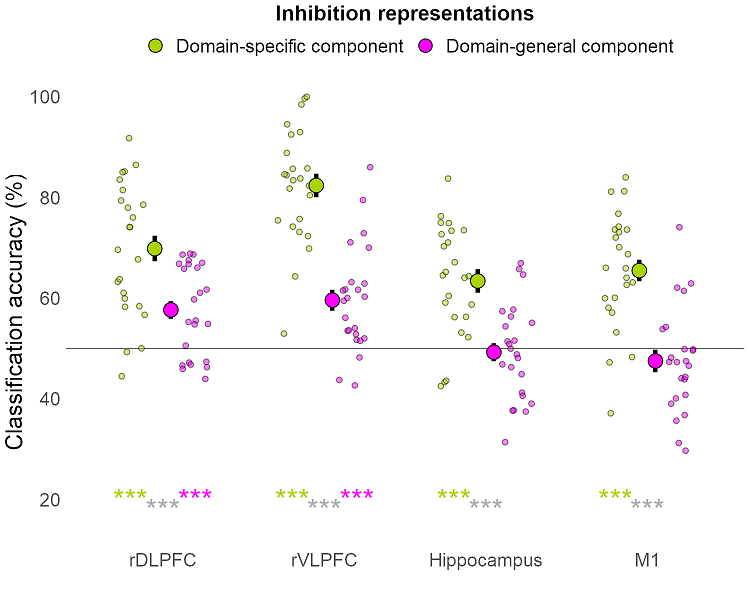


### Domain-specific > Domain-general across ROIs


```R
# DIFFERENCE
# ------------------------------------
# prepare data
sg_dif <- specific[, c("sid", "roi")]
sg_dif$acc <- specific$acc - general$acc

# 1-way RM ANOVA
res.aov <-
  anova_test(data = sg_dif, dv = acc, wid = sid, within = roi)
get_anova_table(res.aov)

# pairwise comparisons
pwc <- sg_dif %>%
  pairwise_t_test(acc ~ roi, paired = TRUE,
                  p.adjust.method = "bonferroni")
pwc

# plot
cat("Error bars: SE")
options(repr.plot.width = 3, repr.plot.height = 3, repr.plot.res = 300)


p_dd_dif <- plot_within_subj_means(sg_dif, "acc", "roi", "sid", 
                                  "Classification accuracy difference", "",
                                  "Domain-specific > Domain-general")

p_dd_dif
#save 
ggsave(file="FigureR1.3.dd.pdf", p_dd_dif, width = 3, height = 3)
```


<table>
<caption>A anova_test: 1 × 7</caption>
<thead>
	<tr><th></th><th scope=col>Effect</th><th scope=col>DFn</th><th scope=col>DFd</th><th scope=col>F</th><th scope=col>p</th><th scope=col>p&lt;.05</th><th scope=col>ges</th></tr>
	<tr><th></th><th scope=col>&lt;chr&gt;</th><th scope=col>&lt;dbl&gt;</th><th scope=col>&lt;dbl&gt;</th><th scope=col>&lt;dbl&gt;</th><th scope=col>&lt;dbl&gt;</th><th scope=col>&lt;chr&gt;</th><th scope=col>&lt;dbl&gt;</th></tr>
</thead>
<tbody>
	<tr><th scope=row>1</th><td>roi</td><td>3</td><td>69</td><td>2.539</td><td>0.064</td><td></td><td>0.067</td></tr>
</tbody>
</table>


<table>
<caption>A rstatix_test: 6 × 10</caption>
<thead>
	<tr><th></th><th scope=col>.y.</th><th scope=col>group1</th><th scope=col>group2</th><th scope=col>n1</th><th scope=col>n2</th><th scope=col>statistic</th><th scope=col>df</th><th scope=col>p</th><th scope=col>p.adj</th><th scope=col>p.adj.signif</th></tr>
	<tr><th></th><th scope=col>&lt;chr&gt;</th><th scope=col>&lt;chr&gt;</th><th scope=col>&lt;chr&gt;</th><th scope=col>&lt;int&gt;</th><th scope=col>&lt;int&gt;</th><th scope=col>&lt;dbl&gt;</th><th scope=col>&lt;dbl&gt;</th><th scope=col>&lt;dbl&gt;</th><th scope=col>&lt;dbl&gt;</th><th scope=col>&lt;chr&gt;</th></tr>
</thead>
<tbody>
	<tr><th scope=row>1</th><td>acc</td><td>rdlpfc</td><td>rvlpfc</td><td>24</td><td>24</td><td>-2.905568</td><td>23</td><td>0.008</td><td>0.048</td><td>* </td></tr>
	<tr><th scope=row>2</th><td>acc</td><td>rdlpfc</td><td>rHC   </td><td>24</td><td>24</td><td>-0.485093</td><td>23</td><td>0.632</td><td>1.000</td><td>ns</td></tr>
	<tr><th scope=row>3</th><td>acc</td><td>rdlpfc</td><td>lM1   </td><td>24</td><td>24</td><td>-1.482362</td><td>23</td><td>0.152</td><td>0.912</td><td>ns</td></tr>
	<tr><th scope=row>4</th><td>acc</td><td>rvlpfc</td><td>rHC   </td><td>24</td><td>24</td><td> 1.755946</td><td>23</td><td>0.092</td><td>0.554</td><td>ns</td></tr>
	<tr><th scope=row>5</th><td>acc</td><td>rvlpfc</td><td>lM1   </td><td>24</td><td>24</td><td> 1.081102</td><td>23</td><td>0.291</td><td>1.000</td><td>ns</td></tr>
	<tr><th scope=row>6</th><td>acc</td><td>rHC   </td><td>lM1   </td><td>24</td><td>24</td><td>-1.015722</td><td>23</td><td>0.320</td><td>1.000</td><td>ns</td></tr>
</tbody>
</table>


    Error bars: SE


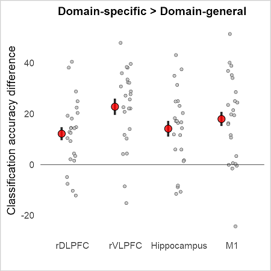


## Domain-general and Within-domain representations

**Within-domain:** an average of Stop $\ne$ Go and No-Think $\ne$ Think

### Prepare data


```R
#
df_w <- subset(df, type == 'd_general' | type == 'within_d')
df_w$type <- factor(df_w$type, levels = c('within_d', 'd_general'))


# PLOT
# ------------------------------------
plot_w <- two_domain_analysis(df_w,
                                   "#468ce2", '#ff00ff',
                                   "Within-domain", "Domain-general",
                                   "Inhibition representations")
```

### Classification accuracies (one-sample t-tests, Bonf. corrected for nr of ROIs)


```R
# do ttests per ROI for each subset of dataset
# ------------------------------------
tres <- sapply(list(within, general), function(x) {
  ddply(x, .(roi), dottest)
})

resdf <- 
  as.data.frame(
      cbind(
      dispresults(tres[, 1]), 
      dispresults(tres[, 2])
      )
  )
colnames(resdf) <- 
  c("within-domain", "domain-general")
resdf

```


<table>
<caption>A data.frame: 4 × 2</caption>
<thead>
	<tr><th scope=col>within-domain</th><th scope=col>domain-general</th></tr>
	<tr><th scope=col>&lt;chr&gt;</th><th scope=col>&lt;chr&gt;</th></tr>
</thead>
<tbody>
	<tr><td>rdlpfc: M = 64% (+-10), t(23) = 6.90, p = 0.000, d = 1.409</td><td>rdlpfc: M = 58% (+-9), t(23) = 4.17, p = 0.001, d = 0.852 </td></tr>
	<tr><td>rvlpfc: M = 69% (+-13), t(23) = 7.21, p = 0.000, d = 1.472</td><td>rvlpfc: M = 60% (+-11), t(23) = 4.46, p = 0.000, d = 0.911</td></tr>
	<tr><td>rHC: M = 59% (+-8), t(23) = 5.48, p = 0.000, d = 1.118    </td><td>rHC: M = 49% (+-10), t(23) = -0.37, p = 1.000, d = -0.075 </td></tr>
	<tr><td>lM1: M = 56% (+-9), t(23) = 3.35, p = 0.006, d = 0.683    </td><td>lM1: M = 48% (+-10), t(23) = -1.16, p = 1.000, d = -0.236 </td></tr>
</tbody>
</table>


### Pair-wise comparisons of domains (Bonf. corrected for nr of ROIs)


```R
# Paired-ttest
# ------------------------------------
ptests <- sapply(seq(1:nrois), function(x) {
  pairedttest(subset(within, roi == rois[x]), subset(general, roi == rois[x]))
})

# get stars for pvalues
sig <- sapply(seq(1:nrois), function(x) {
  stars.pval(ptests[, x]$pval)
})

#add significance stars to the plot
plot_w <- plot_w +
  annotate(
    "text",
    y = 18,
    x = 1:4,
    label = sig,
    size = 10,
    color = "darkgrey"
  )

txt <- lapply(seq(1:nrois), function(x) {
  sprintf(
    "%s: M = %.0f%%, t(%d) = %.2f, p = %.3f, d = %.3f",
    rois[x],
    ptests[, x]$M,
    ptests[, x]$df,
    ptests[, x]$tval,
    ptests[, x]$pval,
    ptests[, x]$tval / sqrt(ptests[, x]$df + 1)
  )
})
ldply(txt, "rbind", .id = "roi")
```


<table>
<caption>A data.frame: 4 × 1</caption>
<thead>
	<tr><th scope=col>1</th></tr>
	<tr><th scope=col>&lt;chr&gt;</th></tr>
</thead>
<tbody>
	<tr><td>rdlpfc: M = 7%, t(23) = 2.41, p = 0.097, d = 0.492</td></tr>
	<tr><td>rvlpfc: M = 9%, t(23) = 3.59, p = 0.006, d = 0.732</td></tr>
	<tr><td>rHC: M = 10%, t(23) = 3.74, p = 0.004, d = 0.763  </td></tr>
	<tr><td>lM1: M = 9%, t(23) = 3.45, p = 0.009, d = 0.704   </td></tr>
</tbody>
</table>


### Main plot


```R
options(repr.plot.width = 10, repr.plot.height = 8, repr.plot.res = 150)
plot_w

#save 
ggsave(file="Figure5c_within.pdf", plot_w, width = 10, height = 8)
```


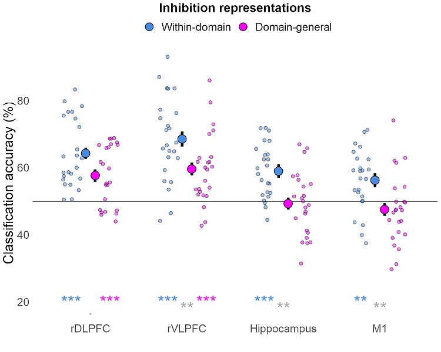


### Within-domain > Domain-general across ROIs


```R
# DIFFERENCE
# ------------------------------------
# prepare data
sg_dif <- within[, c("sid", "roi")]
sg_dif$acc <- within$acc - general$acc

# 1-way RM ANOVA
res.aov <-
  anova_test(data = sg_dif, dv = acc, wid = sid, within = roi)
get_anova_table(res.aov)

# pairwise comparisons
pwc <- sg_dif %>%
  pairwise_t_test(acc ~ roi, paired = TRUE,
                  p.adjust.method = "bonferroni")
pwc


# plot
cat("Error bars: SE")
options(repr.plot.width = 3, repr.plot.height = 3, repr.plot.res = 300)

p_w_dif <- plot_within_subj_means(sg_dif, "acc", "roi", "sid", 
                                  "Classification accuracy difference", "",
                                  "Within-domain > Domain-general")
p_w_dif
#save 
ggsave(file="FigureR1.3.w.pdf", p_w_dif, width = 3, height = 3)
```


<table>
<caption>A anova_test: 1 × 7</caption>
<thead>
	<tr><th></th><th scope=col>Effect</th><th scope=col>DFn</th><th scope=col>DFd</th><th scope=col>F</th><th scope=col>p</th><th scope=col>p&lt;.05</th><th scope=col>ges</th></tr>
	<tr><th></th><th scope=col>&lt;chr&gt;</th><th scope=col>&lt;dbl&gt;</th><th scope=col>&lt;dbl&gt;</th><th scope=col>&lt;dbl&gt;</th><th scope=col>&lt;dbl&gt;</th><th scope=col>&lt;chr&gt;</th><th scope=col>&lt;dbl&gt;</th></tr>
</thead>
<tbody>
	<tr><th scope=row>1</th><td>roi</td><td>3</td><td>69</td><td>0.265</td><td>0.851</td><td></td><td>0.009</td></tr>
</tbody>
</table>


<table>
<caption>A rstatix_test: 6 × 10</caption>
<thead>
	<tr><th></th><th scope=col>.y.</th><th scope=col>group1</th><th scope=col>group2</th><th scope=col>n1</th><th scope=col>n2</th><th scope=col>statistic</th><th scope=col>df</th><th scope=col>p</th><th scope=col>p.adj</th><th scope=col>p.adj.signif</th></tr>
	<tr><th></th><th scope=col>&lt;chr&gt;</th><th scope=col>&lt;chr&gt;</th><th scope=col>&lt;chr&gt;</th><th scope=col>&lt;int&gt;</th><th scope=col>&lt;int&gt;</th><th scope=col>&lt;dbl&gt;</th><th scope=col>&lt;dbl&gt;</th><th scope=col>&lt;dbl&gt;</th><th scope=col>&lt;dbl&gt;</th><th scope=col>&lt;chr&gt;</th></tr>
</thead>
<tbody>
	<tr><th scope=row>1</th><td>acc</td><td>rdlpfc</td><td>rvlpfc</td><td>24</td><td>24</td><td>-0.72041136</td><td>23</td><td>0.479</td><td>1</td><td>ns</td></tr>
	<tr><th scope=row>2</th><td>acc</td><td>rdlpfc</td><td>rHC   </td><td>24</td><td>24</td><td>-0.74893717</td><td>23</td><td>0.461</td><td>1</td><td>ns</td></tr>
	<tr><th scope=row>3</th><td>acc</td><td>rdlpfc</td><td>lM1   </td><td>24</td><td>24</td><td>-0.59450513</td><td>23</td><td>0.558</td><td>1</td><td>ns</td></tr>
	<tr><th scope=row>4</th><td>acc</td><td>rvlpfc</td><td>rHC   </td><td>24</td><td>24</td><td>-0.18152892</td><td>23</td><td>0.858</td><td>1</td><td>ns</td></tr>
	<tr><th scope=row>5</th><td>acc</td><td>rvlpfc</td><td>lM1   </td><td>24</td><td>24</td><td> 0.05724944</td><td>23</td><td>0.955</td><td>1</td><td>ns</td></tr>
	<tr><th scope=row>6</th><td>acc</td><td>rHC   </td><td>lM1   </td><td>24</td><td>24</td><td> 0.35515557</td><td>23</td><td>0.726</td><td>1</td><td>ns</td></tr>
</tbody>
</table>


    Error bars: SE


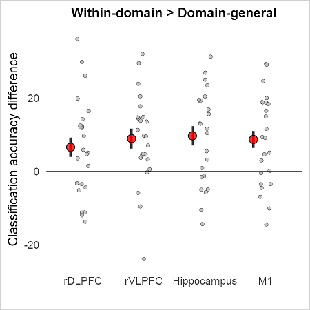


## Cross Action-to-Thought and Action-domain representations

**Action domain:** discriminates between Stop and Go, **Stop $\ne$ Go**

### Prepare data


```R
#
df_a <- subset(df, type == 'action_to_thought' | type == 'ss')
df_a$type <- factor(df_a$type, levels = c('ss', 'action_to_thought'))


# PLOT
# ------------------------------------
plot_a <- two_domain_analysis(df_a,
                                   "#ffc000", '#ff00ff',
                                   "Action-domain", "Cross: Action-to-Thought",
                                   "Inhibition representations")
```

### Classification accuracies (one-sample t-tests, Bonf. corrected for nr of ROIs)


```R
# do ttests per ROI for each subset of dataset
# ------------------------------------
tres <- sapply(list(action, a_to_t), function(x) {
  ddply(x, .(roi), dottest)
})

resdf <- 
  as.data.frame(
      cbind(
      dispresults(tres[, 1]), 
      dispresults(tres[, 2])
      )
  )
colnames(resdf) <- 
  c("action-domain", "cross: action-to-thought")
resdf

```


<table>
<caption>A data.frame: 4 × 2</caption>
<thead>
	<tr><th scope=col>action-domain</th><th scope=col>cross: action-to-thought</th></tr>
	<tr><th scope=col>&lt;chr&gt;</th><th scope=col>&lt;chr&gt;</th></tr>
</thead>
<tbody>
	<tr><td>rdlpfc: M = 59% (+-15), t(23) = 2.81, p = 0.020, d = 0.573</td><td>rdlpfc: M = 60% (+-11), t(23) = 4.27, p = 0.001, d = 0.871</td></tr>
	<tr><td>rvlpfc: M = 65% (+-16), t(23) = 4.54, p = 0.000, d = 0.927</td><td>rvlpfc: M = 61% (+-11), t(23) = 4.90, p = 0.000, d = 1.000</td></tr>
	<tr><td>rHC: M = 58% (+-10), t(23) = 4.00, p = 0.001, d = 0.817   </td><td>rHC: M = 49% (+-13), t(23) = -0.31, p = 1.000, d = -0.063 </td></tr>
	<tr><td>lM1: M = 63% (+-14), t(23) = 4.43, p = 0.000, d = 0.904   </td><td>lM1: M = 46% (+-13), t(23) = -1.72, p = 1.000, d = -0.350 </td></tr>
</tbody>
</table>


### Pair-wise comparisons of domains (Bonf. corrected for nr of ROIs)


```R
# Paired-ttest
# ------------------------------------
ptests <- sapply(seq(1:nrois), function(x) {
  pairedttest(subset(action, roi == rois[x]), subset(a_to_t, roi == rois[x]))
})

# get stars for pvalues
sig <- sapply(seq(1:nrois), function(x) {
  stars.pval(ptests[, x]$pval)
})

#add significance stars to the plot
plot_a <- plot_a +
  annotate(
    "text",
    y = 18,
    x = 1:4,
    label = sig,
    size = 10,
    color = "darkgrey"
  )

txt <- lapply(seq(1:nrois), function(x) {
  sprintf(
    "%s: M = %.0f%%, t(%d) = %.2f, p = %.3f, d = %.3f",
    rois[x],
    ptests[, x]$M,
    ptests[, x]$df,
    ptests[, x]$tval,
    ptests[, x]$pval,
    ptests[, x]$tval / sqrt(ptests[, x]$df + 1)
  )
})
ldply(txt, "rbind", .id = "roi")
```


<table>
<caption>A data.frame: 4 × 1</caption>
<thead>
	<tr><th scope=col>1</th></tr>
	<tr><th scope=col>&lt;chr&gt;</th></tr>
</thead>
<tbody>
	<tr><td>rdlpfc: M = -1%, t(23) = -0.38, p = 1.000, d = -0.078</td></tr>
	<tr><td>rvlpfc: M = 4%, t(23) = 1.28, p = 0.851, d = 0.262   </td></tr>
	<tr><td>rHC: M = 9%, t(23) = 2.66, p = 0.055, d = 0.544      </td></tr>
	<tr><td>lM1: M = 17%, t(23) = 4.24, p = 0.001, d = 0.865     </td></tr>
</tbody>
</table>


### Main plot


```R
options(repr.plot.width = 10, repr.plot.height = 8, repr.plot.res = 150)
plot_a

#save 
ggsave(file="Figure5c_action.pdf", plot_a, width = 10, height = 8)
```


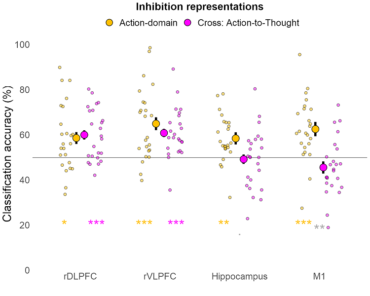


### Action-domain > Domain-general across ROIs


```R
# DIFFERENCE
# ------------------------------------
# prepare data
sg_dif <- action[, c("sid", "roi")]
sg_dif$acc <- action$acc - a_to_t$acc

# 1-way RM ANOVA
res.aov <-
  anova_test(data = sg_dif, dv = acc, wid = sid, within = roi)
get_anova_table(res.aov)

# pairwise comparisons
pwc <- sg_dif %>%
  pairwise_t_test(acc ~ roi, paired = TRUE,
                  p.adjust.method = "bonferroni")
pwc

# plot
cat("Error bars: SE")
options(repr.plot.width = 3, repr.plot.height = 3, repr.plot.res = 300)

p_a_dif <- plot_within_subj_means(sg_dif, "acc", "roi", "sid", 
                                  "Classification accuracy difference", "",
                                  "Action-specific > Cross: Action-to-Thought")
p_a_dif
#save 
ggsave(file="FigureR1.3.a.pdf", p_a_dif, width = 3, height = 3)
```


<table>
<caption>A anova_test: 1 × 7</caption>
<thead>
	<tr><th></th><th scope=col>Effect</th><th scope=col>DFn</th><th scope=col>DFd</th><th scope=col>F</th><th scope=col>p</th><th scope=col>p&lt;.05</th><th scope=col>ges</th></tr>
	<tr><th></th><th scope=col>&lt;chr&gt;</th><th scope=col>&lt;dbl&gt;</th><th scope=col>&lt;dbl&gt;</th><th scope=col>&lt;dbl&gt;</th><th scope=col>&lt;dbl&gt;</th><th scope=col>&lt;chr&gt;</th><th scope=col>&lt;dbl&gt;</th></tr>
</thead>
<tbody>
	<tr><th scope=row>1</th><td>roi</td><td>3</td><td>69</td><td>4.945</td><td>0.004</td><td>*</td><td>0.134</td></tr>
</tbody>
</table>


<table>
<caption>A rstatix_test: 6 × 10</caption>
<thead>
	<tr><th></th><th scope=col>.y.</th><th scope=col>group1</th><th scope=col>group2</th><th scope=col>n1</th><th scope=col>n2</th><th scope=col>statistic</th><th scope=col>df</th><th scope=col>p</th><th scope=col>p.adj</th><th scope=col>p.adj.signif</th></tr>
	<tr><th></th><th scope=col>&lt;chr&gt;</th><th scope=col>&lt;chr&gt;</th><th scope=col>&lt;chr&gt;</th><th scope=col>&lt;int&gt;</th><th scope=col>&lt;int&gt;</th><th scope=col>&lt;dbl&gt;</th><th scope=col>&lt;dbl&gt;</th><th scope=col>&lt;dbl&gt;</th><th scope=col>&lt;dbl&gt;</th><th scope=col>&lt;chr&gt;</th></tr>
</thead>
<tbody>
	<tr><th scope=row>1</th><td>acc</td><td>rdlpfc</td><td>rvlpfc</td><td>24</td><td>24</td><td>-1.2933060</td><td>23</td><td>0.209</td><td>1.000</td><td>ns</td></tr>
	<tr><th scope=row>2</th><td>acc</td><td>rdlpfc</td><td>rHC   </td><td>24</td><td>24</td><td>-1.8521556</td><td>23</td><td>0.077</td><td>0.461</td><td>ns</td></tr>
	<tr><th scope=row>3</th><td>acc</td><td>rdlpfc</td><td>lM1   </td><td>24</td><td>24</td><td>-3.5112885</td><td>23</td><td>0.002</td><td>0.011</td><td>* </td></tr>
	<tr><th scope=row>4</th><td>acc</td><td>rvlpfc</td><td>rHC   </td><td>24</td><td>24</td><td>-0.9974608</td><td>23</td><td>0.329</td><td>1.000</td><td>ns</td></tr>
	<tr><th scope=row>5</th><td>acc</td><td>rvlpfc</td><td>lM1   </td><td>24</td><td>24</td><td>-2.5848943</td><td>23</td><td>0.017</td><td>0.100</td><td>ns</td></tr>
	<tr><th scope=row>6</th><td>acc</td><td>rHC   </td><td>lM1   </td><td>24</td><td>24</td><td>-1.7996849</td><td>23</td><td>0.085</td><td>0.510</td><td>ns</td></tr>
</tbody>
</table>


    Error bars: SE


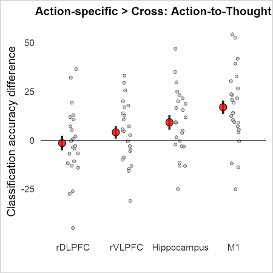


## Domain-general and Thought-domain representations

**Thought domain:** discriminates between No-Think and Think, **No-Think $\ne$ Think**

### Prepare data


```R
#
df_t <- subset(df, type == 'thought_to_action' | type == 'ntnt')
df_t$type <- factor(df_t$type, levels = c('ntnt', 'thought_to_action'))


# PLOT
# ------------------------------------
plot_t <- two_domain_analysis(df_t,
                                   "red", '#ff00ff',
                                   "Thought-domain", "Cross: Thought-to-Action",
                                   "Inhibition representations")
```

### Classification accuracies (one-sample t-tests, Bonf. corrected for nr of ROIs)


```R
# do ttests per ROI for each subset of dataset
# ------------------------------------
tres <- sapply(list(thought, t_to_a), function(x) {
  ddply(x, .(roi), dottest)
})

resdf <- 
  as.data.frame(
      cbind(
      dispresults(tres[, 1]), 
      dispresults(tres[, 2])
      )
  )
colnames(resdf) <- 
  c("thought-domain", "cross: thought_to_action")
resdf

```


<table>
<caption>A data.frame: 4 × 2</caption>
<thead>
	<tr><th scope=col>thought-domain</th><th scope=col>cross: thought_to_action</th></tr>
	<tr><th scope=col>&lt;chr&gt;</th><th scope=col>&lt;chr&gt;</th></tr>
</thead>
<tbody>
	<tr><td>rdlpfc: M = 70% (+-12), t(23) = 7.84, p = 0.000, d = 1.600</td><td>rdlpfc: M = 55% (+-10), t(23) = 2.63, p = 0.030, d = 0.537</td></tr>
	<tr><td>rvlpfc: M = 72% (+-19), t(23) = 5.78, p = 0.000, d = 1.179</td><td>rvlpfc: M = 58% (+-13), t(23) = 3.05, p = 0.011, d = 0.623</td></tr>
	<tr><td>rHC: M = 60% (+-12), t(23) = 4.03, p = 0.001, d = 0.822   </td><td>rHC: M = 49% (+-9), t(23) = -0.32, p = 1.000, d = -0.066  </td></tr>
	<tr><td>lM1: M = 50% (+-10), t(23) = 0.01, p = 1.000, d = 0.001   </td><td>lM1: M = 50% (+-11), t(23) = -0.20, p = 1.000, d = -0.041 </td></tr>
</tbody>
</table>


### Pair-wise comparisons of domains (Bonf. corrected for nr of ROIs)


```R
# Paired-ttest
# ------------------------------------
ptests <- sapply(seq(1:nrois), function(x) {
  pairedttest(subset(thought, roi == rois[x]), subset(t_to_a, roi == rois[x]))
})

# get stars for pvalues
sig <- sapply(seq(1:nrois), function(x) {
  stars.pval(ptests[, x]$pval)
})

#add significance stars to the plot
plot_t <- plot_t +
  annotate(
    "text",
    y = 18,
    x = 1:4,
    label = sig,
    size = 10,
    color = "darkgrey"
  )

txt <- lapply(seq(1:nrois), function(x) {
  sprintf(
    "%s: M = %.0f%%, t(%d) = %.2f, p = %.3f, d = %.3f",
    rois[x],
    ptests[, x]$M,
    ptests[, x]$df,
    ptests[, x]$tval,
    ptests[, x]$pval,
    ptests[, x]$tval / sqrt(ptests[, x]$df + 1)
  )
})
ldply(txt, "rbind", .id = "roi")
```


<table>
<caption>A data.frame: 4 × 1</caption>
<thead>
	<tr><th scope=col>1</th></tr>
	<tr><th scope=col>&lt;chr&gt;</th></tr>
</thead>
<tbody>
	<tr><td>rdlpfc: M = 15%, t(23) = 4.73, p = 0.000, d = 0.966</td></tr>
	<tr><td>rvlpfc: M = 14%, t(23) = 3.52, p = 0.007, d = 0.719</td></tr>
	<tr><td>rHC: M = 10%, t(23) = 3.43, p = 0.009, d = 0.699   </td></tr>
	<tr><td>lM1: M = 0%, t(23) = 0.20, p = 1.000, d = 0.040    </td></tr>
</tbody>
</table>


### Main plot


```R
options(repr.plot.width = 10, repr.plot.height = 8, repr.plot.res = 150)
plot_t

#save 
ggsave(file="Figure5c_thought.pdf", plot_t, width = 10, height = 8)
```


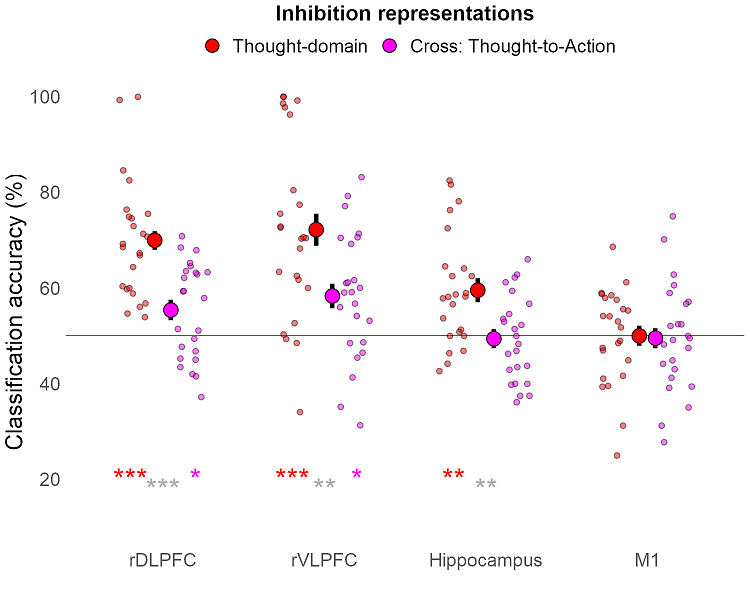


### Thought-domain > Domain-general across ROIs


```R
# DIFFERENCE
# ------------------------------------
# prepare data
sg_dif <- thought[, c("sid", "roi")]
sg_dif$acc <- thought$acc - t_to_a$acc

# 1-way RM ANOVA
res.aov <-
  anova_test(data = sg_dif, dv = acc, wid = sid, within = roi)
get_anova_table(res.aov)

# pairwise comparisons
pwc <- sg_dif %>%
  pairwise_t_test(acc ~ roi, paired = TRUE,
                  p.adjust.method = "bonferroni")
pwc


# plot
cat("Error bars: SE")
options(repr.plot.width = 3, repr.plot.height = 3, repr.plot.res = 300)

p_t_dif <- plot_within_subj_means(sg_dif, "acc", "roi", "sid", 
                                  "Classification accuracy difference", "",
                                  "Domain-specific > Cross: Thought-to-Action")
p_t_dif
#save 
ggsave(file="FigureR1.3.t.pdf", p_t_dif, width = 3, height = 3)
```


<table>
<caption>A anova_test: 1 × 7</caption>
<thead>
	<tr><th></th><th scope=col>Effect</th><th scope=col>DFn</th><th scope=col>DFd</th><th scope=col>F</th><th scope=col>p</th><th scope=col>p&lt;.05</th><th scope=col>ges</th></tr>
	<tr><th></th><th scope=col>&lt;chr&gt;</th><th scope=col>&lt;dbl&gt;</th><th scope=col>&lt;dbl&gt;</th><th scope=col>&lt;dbl&gt;</th><th scope=col>&lt;dbl&gt;</th><th scope=col>&lt;chr&gt;</th><th scope=col>&lt;dbl&gt;</th></tr>
</thead>
<tbody>
	<tr><th scope=row>1</th><td>roi</td><td>3</td><td>69</td><td>4.267</td><td>0.008</td><td>*</td><td>0.121</td></tr>
</tbody>
</table>


<table>
<caption>A rstatix_test: 6 × 10</caption>
<thead>
	<tr><th></th><th scope=col>.y.</th><th scope=col>group1</th><th scope=col>group2</th><th scope=col>n1</th><th scope=col>n2</th><th scope=col>statistic</th><th scope=col>df</th><th scope=col>p</th><th scope=col>p.adj</th><th scope=col>p.adj.signif</th></tr>
	<tr><th></th><th scope=col>&lt;chr&gt;</th><th scope=col>&lt;chr&gt;</th><th scope=col>&lt;chr&gt;</th><th scope=col>&lt;int&gt;</th><th scope=col>&lt;int&gt;</th><th scope=col>&lt;dbl&gt;</th><th scope=col>&lt;dbl&gt;</th><th scope=col>&lt;dbl&gt;</th><th scope=col>&lt;dbl&gt;</th><th scope=col>&lt;chr&gt;</th></tr>
</thead>
<tbody>
	<tr><th scope=row>1</th><td>acc</td><td>rdlpfc</td><td>rvlpfc</td><td>24</td><td>24</td><td>0.1531101</td><td>23</td><td>0.880000</td><td>1.000</td><td>ns</td></tr>
	<tr><th scope=row>2</th><td>acc</td><td>rdlpfc</td><td>rHC   </td><td>24</td><td>24</td><td>1.1277515</td><td>23</td><td>0.271000</td><td>1.000</td><td>ns</td></tr>
	<tr><th scope=row>3</th><td>acc</td><td>rdlpfc</td><td>lM1   </td><td>24</td><td>24</td><td>4.0869753</td><td>23</td><td>0.000453</td><td>0.003</td><td>**</td></tr>
	<tr><th scope=row>4</th><td>acc</td><td>rvlpfc</td><td>rHC   </td><td>24</td><td>24</td><td>0.6550404</td><td>23</td><td>0.519000</td><td>1.000</td><td>ns</td></tr>
	<tr><th scope=row>5</th><td>acc</td><td>rvlpfc</td><td>lM1   </td><td>24</td><td>24</td><td>2.6267957</td><td>23</td><td>0.015000</td><td>0.091</td><td>ns</td></tr>
	<tr><th scope=row>6</th><td>acc</td><td>rHC   </td><td>lM1   </td><td>24</td><td>24</td><td>2.9571099</td><td>23</td><td>0.007000</td><td>0.042</td><td>* </td></tr>
</tbody>
</table>


    Error bars: SE


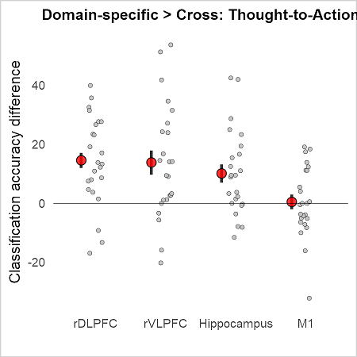


## NT is Stop rather than Go, per run (Adaptive forgetting)


```R
# ----------------------------------------------------------------------
# PLOTTING FUNCTION
# ----------------------------------------------------------------------
plotAcc <- function(dataset, labelstxt, title) {
  # aggregate
  res1 <- dataset %>% # this is to get correct means, ignoring NaNs
     group_by(run) %>%
     get_summary_stats(acc, type = "mean")
  res2 <- # this is to get within-subject SEs
   summarySEwithin(
      dataset,
      measurevar = "acc",
      withinvars = c("run"),
      idvar = "sNR",
      na.rm = TRUE,  
      conf.interval = 0.95, 
    )
    res <- data.frame(run = res1$run, acc = res1$mean, se = res2$se)   
  # plot
  ggplot(data = res, aes(x = run, y = acc, group=1)) +
    geom_hline(aes(yintercept = 50), size = 0.2, color = "red") +
    geom_line(size = 0.5) +    
    geom_point() +
    geom_ribbon(
      aes(
        ymin = acc - se,
        ymax = acc + se,
        x = run
      ),
      alpha = 0.3,
      fill = 'grey',     
      show.legend = FALSE
    ) +
    ylim(20,100) +
    #geom_line(aes(x = run, y = acc - se), size = 0.1) +
    #geom_line(aes(x = run, y = acc + se), size = 0.1) +
    labs(x = "Run", y = "Classification accuracy (%)") +
    geom_text(aes(label = sprintf('%d%%', round(acc,0))), vjust = -1.5) +
    ggtitle(title) +
    guides(color = guide_legend("")) +
    theme_minimal() +
    theme(
      legend.position = "top",
      text = element_text(size = 14),
      plot.title = element_text(
        hjust = 0.5,
        size = 14,
        face = "bold"
      ),
      panel.grid.major = element_blank(),
      panel.grid.minor = element_blank()
    )
}
## Per-sun accuracies
perRunResults <- function(data){
    Slope <- data$propslope
    SIF   <- data$SIF
    SSRT  <- data$SSRT
    sNR   <- data$sNR

    df <- gather(data, run, acc, run1:run8, factor_key = TRUE)
    df$sNR <- as.factor(df$sNR)
    #----------------
    ## ANOVA
    contrasts(df$run) <- contr.poly
    res.aov <- aov(acc ~ run + Error(sNR), data = df)
    print(summary(res.aov, split = list(run = list(Linear = 1))))
    
    ## PLOT    
    p1 <- plotAcc(df, c("Runs"), "")   
    
    ## OUTLIERS
    sif_slope_outliers <- get_outliers(SIF, "SIF", "%", Slope, "Slope", "", disp = FALSE)
    ssrt_slope_outliers <- get_outliers(SSRT, "SSRT", "%", Slope, "Slope", "", disp = FALSE)
    
    ## CORRELATIONS
    # SIF/Slope
    p2 <- plotCorrelation(SIF, Slope,"Inhibiting memories (SIF, %)","Classification accuracy slope",
                    doCorrelation(SIF, Slope, sif_slope_outliers),
                    1.8, 14, sif_slope_outliers, FALSE)
    
    #SSRT/Slope
    p3 <- plotCorrelation(SSRT, Slope,"Inhibiting actions (SSRT, ms)","Classification accuracy slope",
                    doCorrelation(SSRT, Slope, ssrt_slope_outliers),
                    1.8, 14, ssrt_slope_outliers, FALSE)
    
   # plots <- grid.arrange(p1, p2, p3, nrow=2)
    
    ## Put all plots in a grid and display
    plots <- grid.arrange(p1, p2, p3, nrow=3)
    
    #plots <- grid.arrange(
      #  arrangeGrob(p1, 
      #              top = "Accuracy of the action-stopping classifier to discriminate thought suppression", 
      #              layout_matrix = rbind(c(1,1))),
      #  arrangeGrob(p2, p3, 
      #              top = '\nRelationship between the accuracy declain and behavioural measures of inhibition\n', 
      #              nrow = 1))
      #  
    
    return(plots)
    }
```


```R
# ----------------------------------------------------------------------
# GET THE DATA
# ----------------------------------------------------------------------
ccdata <- read.csv('https://raw.githubusercontent.com/dcdace/tmp/master/data/perRunCrossClassification.csv')
ccdata[,5:12] <- ccdata[,5:12]*100
head(ccdata)
ccdata_rDLPFC <- subset(ccdata, ROI == 'rDLPFC')
ccdata_rVLPFC <- subset(ccdata, ROI == 'rVLPFC')
ccdata_HC     <- subset(ccdata, ROI == 'HC')
ccdata_M1     <- subset(ccdata, ROI == 'M1')
```


<table>
<caption>A data.frame: 6 × 14</caption>
<thead>
	<tr><th></th><th scope=col>sNR</th><th scope=col>SIF</th><th scope=col>SSRT</th><th scope=col>ROI</th><th scope=col>run1</th><th scope=col>run2</th><th scope=col>run3</th><th scope=col>run4</th><th scope=col>run5</th><th scope=col>run6</th><th scope=col>run7</th><th scope=col>run8</th><th scope=col>propslope</th><th scope=col>X</th></tr>
	<tr><th></th><th scope=col>&lt;int&gt;</th><th scope=col>&lt;dbl&gt;</th><th scope=col>&lt;dbl&gt;</th><th scope=col>&lt;chr&gt;</th><th scope=col>&lt;dbl&gt;</th><th scope=col>&lt;dbl&gt;</th><th scope=col>&lt;dbl&gt;</th><th scope=col>&lt;dbl&gt;</th><th scope=col>&lt;dbl&gt;</th><th scope=col>&lt;dbl&gt;</th><th scope=col>&lt;dbl&gt;</th><th scope=col>&lt;dbl&gt;</th><th scope=col>&lt;dbl&gt;</th><th scope=col>&lt;lgl&gt;</th></tr>
</thead>
<tbody>
	<tr><th scope=row>1</th><td>1</td><td> 0.07986111</td><td>295.1301</td><td>rDLPFC</td><td>100.00000</td><td> 87.077922</td><td>38.37662</td><td> 35.58442</td><td> 4.025974</td><td>90.97403</td><td> 11.81818</td><td>13.506493</td><td>-0.10</td><td>NA</td></tr>
	<tr><th scope=row>2</th><td>2</td><td> 0.03589744</td><td>402.4228</td><td>rDLPFC</td><td> 99.10000</td><td> 77.450000</td><td> 0.00000</td><td>100.00000</td><td>99.750000</td><td>99.75000</td><td>100.00000</td><td> 2.100000</td><td>-0.03</td><td>NA</td></tr>
	<tr><th scope=row>3</th><td>3</td><td> 0.15919118</td><td>367.9818</td><td>rDLPFC</td><td>100.00000</td><td>100.000000</td><td>98.80000</td><td> 96.80000</td><td>99.600000</td><td> 0.00000</td><td>  0.80000</td><td>      NaN</td><td>-0.18</td><td>NA</td></tr>
	<tr><th scope=row>4</th><td>4</td><td> 0.19444444</td><td>288.9256</td><td>rDLPFC</td><td> 54.85000</td><td>100.000000</td><td>28.10000</td><td> 10.45000</td><td>99.150000</td><td>39.10000</td><td>  0.00000</td><td>73.950000</td><td>-0.05</td><td>NA</td></tr>
	<tr><th scope=row>5</th><td>5</td><td> 0.07500000</td><td>296.7227</td><td>rDLPFC</td><td>100.00000</td><td>  7.575758</td><td>72.72727</td><td> 51.51515</td><td>34.848485</td><td>15.15152</td><td>100.00000</td><td> 4.545454</td><td>-0.05</td><td>NA</td></tr>
	<tr><th scope=row>6</th><td>6</td><td>-0.02777778</td><td>400.1622</td><td>rDLPFC</td><td> 74.26471</td><td>  0.000000</td><td>49.26471</td><td>  0.00000</td><td>91.911765</td><td>87.50000</td><td> 94.11765</td><td> 1.470588</td><td> 0.03</td><td>NA</td></tr>
</tbody>
</table>


### rDLPFC, Figure 6_dlpfc


```R
options(repr.plot.width = 5, repr.plot.height = 10, repr.plot.res = 200)
rDLPFC_plots <-perRunResults(ccdata_rDLPFC)
#save 
ggsave(file="Figure6_dlpfc.pdf", rDLPFC_plots, width=5, height=10, device = cairo_pdf) 
#cairo_pdf deals with font embedding
```

    
    Error: sNR
                  Df Sum Sq Mean Sq F value Pr(>F)
    run            2   3697  1848.7   1.948  0.167
      run: Linear  1   2340  2340.5   2.466  0.131
    Residuals     21  19928   948.9               
    
    Error: Within
                   Df Sum Sq Mean Sq F value  Pr(>F)   
    run             7  20030    2861   1.823 0.08633 . 
      run: Linear   1  15089   15089   9.613 0.00229 **
    Residuals     157 246421    1570                   
    ---
    Signif. codes:  0 '***' 0.001 '**' 0.01 '*' 0.05 '.' 0.1 ' ' 1
    


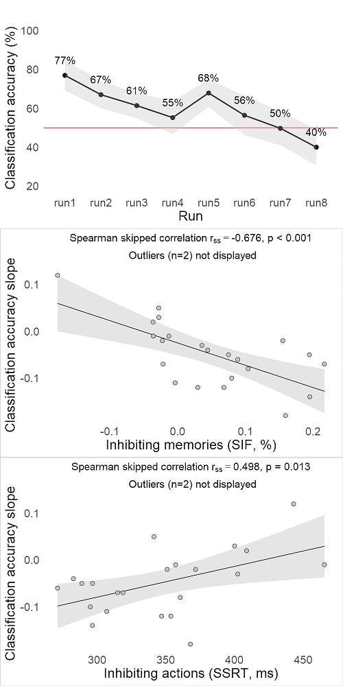


### rVLPFC, Figure 6_vlpfc


```R
options(repr.plot.width = 5, repr.plot.height = 10, repr.plot.res = 200)
rVLPFC_plots <-perRunResults(ccdata_rVLPFC)
#save 
ggsave(file="Figure6_vlpfc.pdf", rVLPFC_plots, width=5, height=10, device = cairo_pdf) 
#cairo_pdf deals with font embedding
```

    
    Error: sNR
                  Df Sum Sq Mean Sq F value   Pr(>F)    
    run            2   8997    4499    8.84 0.001639 ** 
      run: Linear  1   8974    8974   17.64 0.000403 ***
    Residuals     21  10687     509                     
    ---
    Signif. codes:  0 '***' 0.001 '**' 0.01 '*' 0.05 '.' 0.1 ' ' 1
    
    Error: Within
                   Df Sum Sq Mean Sq F value Pr(>F)  
    run             7  27239    3891   2.124 0.0440 *
      run: Linear   1   5271    5271   2.877 0.0918 .
    Residuals     157 287597    1832                 
    ---
    Signif. codes:  0 '***' 0.001 '**' 0.01 '*' 0.05 '.' 0.1 ' ' 1
    


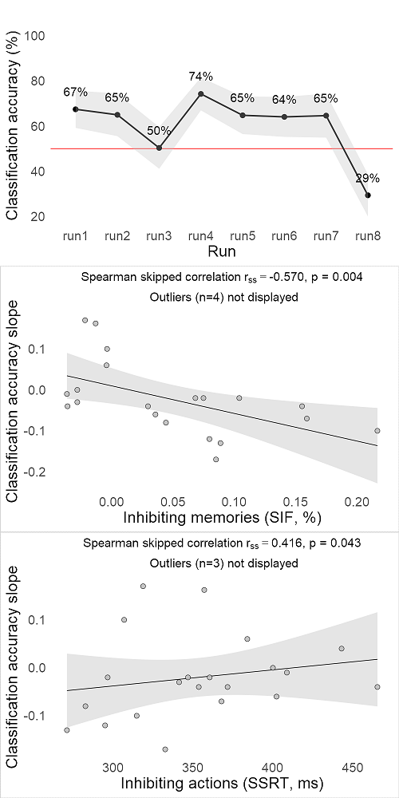


### Hippocampus


```R
options(repr.plot.width = 5, repr.plot.height = 10, repr.plot.res = 200)
HC_plots <- perRunResults(ccdata_HC)
```

    
    Error: sNR
                  Df Sum Sq Mean Sq F value Pr(>F)
    run            2   2694  1347.0   1.011  0.381
      run: Linear  1    635   635.3   0.477  0.497
    Residuals     21  27986  1332.6               
    
    Error: Within
                   Df Sum Sq Mean Sq F value Pr(>F)
    run             7   6033   861.9   0.494  0.838
      run: Linear   1    121   120.6   0.069  0.793
    Residuals     157 273893  1744.5               
    


### M1


```R
options(repr.plot.width = 5, repr.plot.height = 10, repr.plot.res = 200)
M1_plots <- perRunResults(ccdata_M1)
```

    
    Error: sNR
                  Df Sum Sq Mean Sq F value Pr(>F)
    run            2   3401    1700   1.406  0.267
      run: Linear  1    457     457   0.378  0.545
    Residuals     21  25394    1209               
    
    Error: Within
                   Df Sum Sq Mean Sq F value Pr(>F)
    run             7   8323    1189   0.808  0.582
      run: Linear   1   1819    1819   1.236  0.268
    Residuals     157 231097    1472               
    


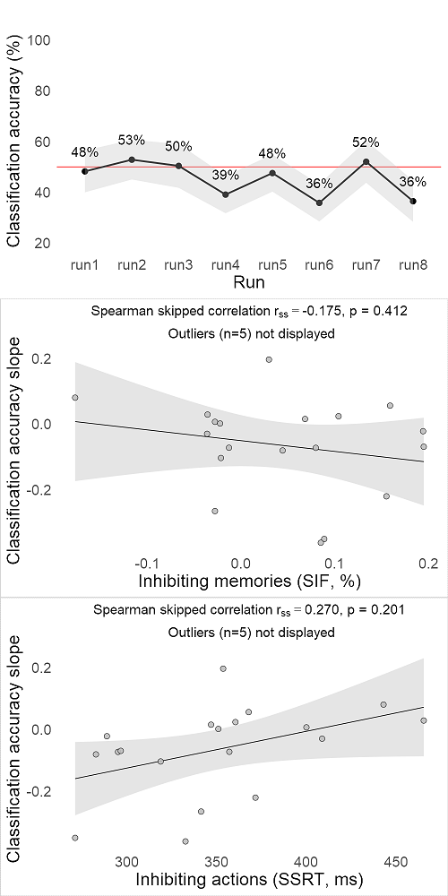


# DCM results


```R
# ----------------------------------------------------------------------
# GET THE DATA
# ----------------------------------------------------------------------
df_dcm <-
  read.csv(
    'https://raw.githubusercontent.com/dcdace/tmp/master/data/DCM_results.csv',
    fileEncoding = "UTF-8-BOM"
  )
df_dcm$Name <- factor(df_dcm$Name, levels = df_dcm$Name)

models        <- subset(df_dcm, Type == 'm')
models$Name   <- models$Nr

fDirection    <- subset(df_dcm, Type == 'Direction')
fPathways     <- subset(df_dcm, Type == 'Pathways')
fInteractions <- subset(df_dcm, Type == 'Interactions')
fTargets      <- subset(df_dcm, Type == 'Targets')
```


```R
# ----------------------------------------------------------------------
# PLOTTING FUNCTION
# ----------------------------------------------------------------------
plotDCM <- function(dataset, r, plottitle, ytitle) {  
    ggplot(dataset, aes(x = Name, y = EP, label = round(EP, r))) +
    ggtitle(plottitle) +
    geom_bar(
        stat = "identity",
        color = "black",
        fill = "darkgrey",
        alpha = 0.3,
        lwd = 1) +
    geom_text(data = dataset[dataset$EP > 0.03,], size = 5, nudge_y = 0.065) +
    scale_y_continuous(ytitle,
                     limits = c(0, 1.1),
                     breaks = seq(0, 1, 0.2)) +
    theme_classic(base_size = 20) + 
    theme(axis.line = element_line(size = 1),
          axis.ticks = element_line(size = 1),
          axis.text.x = element_text(angle = 35, hjust = 0.99),
          axis.title.x = element_blank())    
    }
```


```R
bp1 <- plotDCM(fDirection, 4, "Direction", "Exceedance probability")
bp2 <- plotDCM(fPathways, 4, "Pathways", "") + theme(axis.title.y = element_blank())
bp3 <- plotDCM(fInteractions, 2, "Interactions", "") + 
            scale_x_discrete(labels = 
                     c("None", 
                       expression("DLPFC" %->% "VLPFC"), 
                       expression("DLPFC" %<-% "VLPFC"), 
                       expression("DLPFC" %<->% "VLPFC"))) + 
            theme(axis.title.y = element_blank())
bp4 <- plotDCM(fTargets, 2, "Targets", "") + theme(axis.title.y = element_blank())
bp5 <- plotDCM(models, 2, "All models", "") + 
            scale_x_continuous(breaks = seq(0, 72, 4)) +
            theme(axis.title.y = element_blank(), axis.text.x = element_text(angle = 0, hjust = 0.5))
```

## Figure 7b-f


```R
# ==================================================================
# PLOT 
# ==================================================================
options(repr.plot.width = 20, repr.plot.height = 5, repr.plot.res = 200)
plot.dcm <- 
  plot_grid(bp1, bp2, bp3, bp4, bp5, nrow = 1, align = "h", 
            rel_widths = c(6/15,5.5/15,5.5/15,3.3/15,12/15))

# display
plot.dcm

#save 
svg("Figure7b_f.svg") 
plot.dcm
dev.off()
```


<strong>png:</strong> 2


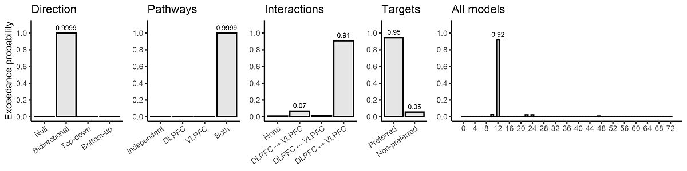


```R
# reset to defult plot size
options(repr.plot.width = 7, repr.plot.height = 7)
```
